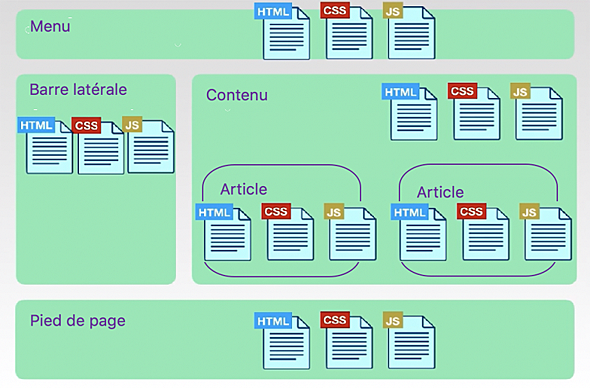

# Les composants

Par [Valentin Brosseau](https://github.com/c4software) / [@c4software](http://twitter.com/c4software)

---


---

Un composant est une instance de code (d'interface et de logique liées à celle-ci) **réutilisable** et **héritable**.

---

## Pourquoi utiliser une approche composants ?

À votre avis ?

---

- Réutilisation.
- Logique commune.
- Style propre au projet.
- Comportement adapté au projet.
- Héritable (composant enfant, composant parent).

---

## Un peu d'histoire…

- Organisation en fichier (include).
- Code et affichage séparé.
- CSS (style) à côté et inclus.
- Les librairies de templates

---

Petit exemple de template

```html

<div>
    <h1>{{title}}</h1>
    <p>{{contenu}}</p>
</div>
```

---

## L'objectif ? Simplifier le partage.

### Et la réutilisation

Exemples avec des projets open source.

- [Bootstrap-Vue](https://bootstrap-vue.org/)
- [Vuetify](https://vuetifyjs.com/en/)
- [Material Design 3](https://m3.material.io/components/buttons/implementation/android)
- [Les composants Laravel](https://laravel.com/docs/9.x/blade#rendering-components)

---

## Mais un composant c'est quoi ?

---

## Exemple avec VueJS

---



---

```html
<mon-header></mon-header>
```

---

<div style="width:100%;height:0;padding-bottom:71%;position:relative;"><iframe src="https://giphy.com/embed/3o7qDSOvfaCO9b3MlO" width="100%" height="100%" style="position:absolute" frameBorder="0" class="giphy-embed" allowFullScreen></iframe></div>

---

## Un peu d'observation…

---

```html
<template>
    <div @click="home">
        Mon header
    </div>
</template>
<script setup lang="js">
    import {useRouter} from "vue-router";

    const router = useRouter();
    
    function home(){
        router.go("/");    
    }
</script>
<style scopped>
    div{
        background: red;
        width: 100vw;
        height: 80px;
    }
</style>
```

---

## L'important c'est … l'imbrication

```html

<ma-page>
    <mon-header></mon-header>
    <mon-menu></mon-menu>
    <mon-contenu>
        <h1>Titre de mon contenu</h1>
        <mon-bouton></mon-bouton>
    </mon-contenu>
    <mon-footer></mon-footer>
</ma-page>

```

---

## Des questions ?

---

## Et sur Android ?

Plus compliqué ? Pas vraiment !

---


Qu'observez-vous ? Est-ce différent ?

---

## Composer l'interface

---

<div style="width:100%;height:0;padding-bottom:56%;position:relative;"><iframe src="https://giphy.com/embed/U6RXibdvKJTtGL9Cmw" width="100%" height="100%" style="position:absolute" frameBorder="0" class="giphy-embed" allowFullScreen></iframe></div>

---

- L'interface.
- La logique.
- L'interaction.
- L'apparence.

---

## Des questions ?

---

- [Les composants Laravel](https://laravel.com/docs/9.x/blade#rendering-components)

---

## Pour résumer

---

- Disponible dans plusieurs Frameworks.
- Découper en composants « fonctionnels ».
- Interface réactive.
- Interaction simplifiée.

Exemple: [Un chat](https://cours.brosseau.ovh/cours/demo/vuejs/chat.html)

---

## Deux mises en pratique

- Créer des composants avec VueJS.
- Créer des composants avec Android et Jetpack Compose.

---

## Des questions ?