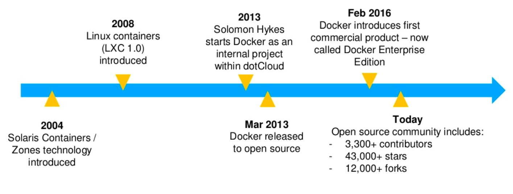
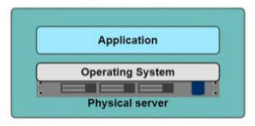
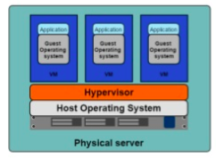
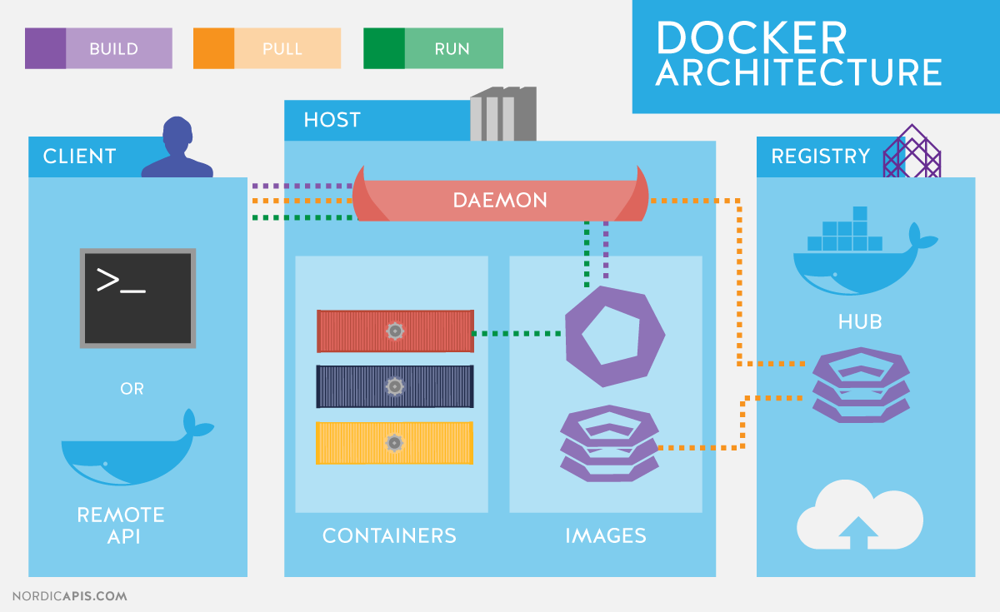

# Docker

## Le Conteneur d’applications

Par [Valentin Brosseau](https://github.com/c4software) / [@c4software](http://twitter.com/c4software)

---


---

### Évolution du paysage de l’informatique


---

### Mouvement vers le cloud, Pourquoi ?

- Migrer la puissance dans le Cloud
- Changement d’environnement/plateforme simplifié
- Pas de « Bloquage / Fermeture » d’un constructeur

---

### Le Cloud pour vous c’est quoi ?

---

### Une évolution de l’informatique

---

### Avant

- Monolithique
- Mise à jour lente
- Gros serveurs

---

### Maintenant

- Plein de petits services assemblés (externes et indépendants les uns des autres)
- Mise à jour rapide
- Petites machines, multitude de serveurs, etc.

---

### Mouvement global de découpage en

### « micro services »

Des exemples en tête ?

---


---

### Les problèmes « d’avant »

Un changement mineur impose de recompiler toute l’application. (et ça peut être long…)


Très très long… (Linux ~2h, Firefox 40min)

---

- L’application est centrale au fonctionnement.
- Adaptation au changement difficile.

---

### La solution : « Les microservices »

- Découper l’application en fonctionnalités indépendantes
- Rends l’application indépendante des autres
- Capable de « multiplier » l’application sur plein de serveurs pour absorber une hausse de la demande.
- Une conception qui rend l’application hautement disponible

---

### Un autre mouvement… L’intégration continue / Livraison continue

- Tests en continues
- Validation du fonctionnement en continu
- Mise en production continue

---

### Et donc, Docker?


---

### L’histoire de Docker



---

### Quelques chiffres

- 14 millions de « machines »
- 900 000 images Docker
- 12 milliards d’images téléchargées
- 3300 contributeurs au projet

---

### Car Oui… Docker est OPEN SOURCE.

---

### Bon c’est bien, mais comment ça fonctionne ?


---

### Mais avant… Un peu d’histoire…


---

### Au début…

#### Une application sur … UN serveur



Quelles sont les limitations à votre avis ?

---

### Les hyperviseurs, la virtualisation



- Un serveur plusieurs applications
- Chaque application fonctionne dans une machine virtuelle

Votre avis sur cette solution ?

---

### Les limitations des machines virtuelles

- Des ressources allouées pour chaque machine (CPU, Disque, Ram)
- Un OS complet sur chaque machine (virtuelle)
- Plus il y a de machines plus il faut de puissance (ressources perdues)
- Ressources perdues par… des parties de l’OS virtualisées pour rien

---

### Docker… Les Containers / Conteneurs à la rescousse

#### Un conteneur c’est…

- Un moyen standardiser de packager l’application
- Un moyen d’isoler les applications entres elles
- Un partage du noyau avec la machine physique

---


---

### VM vs Conteneur


---

### À votre avis, est-ce la fin des VM ?

---


---

### La terminologie

- _Image_ Les fichiers, le contenu de votre « système »
- _Container_ L’image quand elle est en fonctionnement.
- _Engine_ Ce qui fait fonctionner votre « container ». Les volumes et le réseau font partie de « l’engine ».
- _Registry_ Entrepôt d’image à télécharger (fourni par d’autres, ou construite par vous). [https://hub.docker.com/](https://hub.docker.com/)
- _Volume_, les « montages » / ressources, emplacement (réseau ou non) disponible dans votre Container.

---

### Pour résumer Docker c’est :

- Un projet open source qui a pour but d’automatiser le déploiement d’applications dans un « container »
- Le container une sorte « d’archive » qui contient tout ce qu’il faut pour faire fonctionner un logiciel : Code, Librairies pour l’exécution, outils système, et librairies système. (autonome)
- Ça garantit que le code fonctionnera toujours de la même façon, quel que soit l’environnement.

---



---

### Le Docker Engine :

- La sécurité
- Le réseau
- Les volumes
- L’orchestration

---


---

### Mais surtout l’engine…

#### Est portable, ça fonctionne sur

- Linux
- OSX
- Windows

---

### Registry

- Docker Hub
- Communautaire
- Images certifiées
- Énormément d’images

---

### Les images

- C’est un « template »
- Lecture seule
- Exemple: Ubuntu avec un Apache et GLPI déjà installés

---

### Pour le développeur, c’est

- Une façon simple de distribuer vos applications
- Pas de risque d’oubli de dépendances lors de l’installation (un environnement maitrisé)
- Fonctionnement isolé, tests simplifiés de nouvelles librairies, ou de dépendances

---

### Mais c'est également

- Un moyen simple de créer un environnement
- Une solution cross plateforme
- Un outil magique

---

### Cas d'usage 0

#### Postgres

```sh
docker run -p 5432:5432 --name pgServer -e POSTGRES_USER=monUser -e POSTGRES_PASSWORD=monPassword -d postgres
```

---

### Cas d’usage 1

#### Wordpress

- Image officielle
- Créer un Blog Wordpress en 2 minutes

---

### Cas d’usage 2

#### Tomcat

- Plusieurs versions en parallèle
- Plusieurs versions de Java

---

### Cas d’usage 3

#### PHP

- Plusieurs versions en parallèle
- Tester simplement son code sur d’autres versions de PHP (5, 7, 8, …)

---

### Mais concrètement…

#### Créer la définition d’un container

---

### Le Docker File

- Utilisé par Docker pour créer des containers à partir de la définition, le fichier « Dockerfile »
- C’est un fichier texte, qui contient toutes les commandes que l’utilisateur va faire pour assembler l’image
- Construit via la commande « docker build »

---

### Le Docker File

```dockerfile
FROM ubuntu:latest
MAINTAINER Valentin Brosseau

RUN apt-get update
RUN apt-get install -y python python-pip wget
RUN pip install Flask

ADD hello.py /home/hello.py

WORKDIR /home
```

---

### La construction

```sh
docker build -t "flask:demo" .
```

---

### Lancement

```sh
docker run -p 5000:5000 flask:demo python hello.py
```

---

### Détaillons un peu la commande

---

### Mais…

Le container est _éphémère,_ il ne sauvegarde rien, à chaque arrêt tout est supprimé.

---

### Mais ?

Pour _sauvegarder_ de la donnée, il faut faire un volume.

---

### Un volume

- Un dossier « partagé » entre votre machine et le container
- Une sorte de point de montage
- Persistant, la donnée est modifiée en temps réel et est sauvegardée

---

### Quelques commandes Docker

- docker run
- docker ps
- docker stop|start|restart
- docker build
- docker rm
- docker logs
- docker system prune
- docker volume prune

---

## DÉMO

---

### Des stocks complètent

### Souvent un produit c’est plusieurs applications

---

### Place à L’orchestration

---


---

### Docker Compose

Permets de composer une stack ou une infrastructure complète de conteneurs. Celui-ci permet de simplifier la création, l'interconnexion et la multiplication de conteneurs.

---

### C’est un outil officiel - fourni par Docker

---

### Un fichier… le docker-compose.yml

---

```yaml
version: "3"
services:
  reverse-proxy:
    restart: unless-stopped
    network_mode: host
    image: nginx
    volumes:
      - ../.acme.sh/:/etc./letsencrypt/
      - ./nginx.conf:/etc./nginx/nginx.conf
```

---

### Détaillons un peu ce fichier

---

### Utilisation

- `docker compose up`
- `docker compose up -d`

---

```yaml
version: "3"
services:
  homeassistant:
    container_name: homeassistant
    image: homeassistant/raspberrypi4-homeassistant:stable
    volumes:
      - ./config:/config
      - /etc./localtime:/etc/localtime:ro
    restart: unless-stopped
    devices:
      - "/dev/ttyACM0:/dev/ttyACM0:rwm"
    network_mode: host
```

---

### L'exemple de Wordpress

```yaml
ersion: "3.9"

services:
  db:
    image: mysql:5.7
    volumes:
      - db_data:/var/lib/mysql
    restart: always
    environment:
      MYSQL_ROOT_PASSWORD: somewordpress
      MYSQL_DATABASE: wordpress
      MYSQL_USER: wordpress
      MYSQL_PASSWORD: wordpress

  wordpress:
    depends_on:
      - db
    image: wordpress:latest
    ports:
      - "8000:80"
    restart: always
    environment:
      WORDPRESS_DB_HOST: db:3306
      WORDPRESS_DB_USER: wordpress
      WORDPRESS_DB_PASSWORD: wordpress
      WORDPRESS_DB_NAME: wordpress
volumes:
  db_data: {}
```

---

### Docker est-il la seule solution ?

- containerd
- podman
- Kubernetes (parlons-en d'ailleurs)

---

### Des questions ?

---
