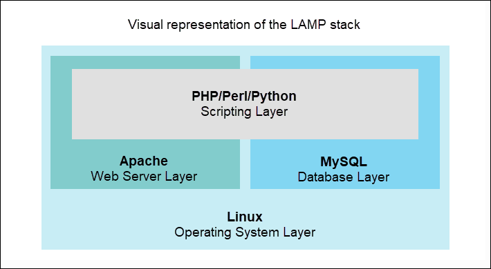

# Serveur / DevOps

## Déployer, automatiser, comprendre

Par [Valentin Brosseau](https://github.com/c4software) / [@c4software](http://twitter.com/c4software)

---

## Sommaire

- DevOps
- Les OS et les développeurs
- Qu'est-ce qu'un serveur (App, Web, BDD)
- La constitution d'un serveur (OS, Services, Applications)
- Les vhosts, les ports, etc.
- L'accès à distance

---

## Sommaire

- Diagnostiquer un problème
- La Sécurité (Ports, Services, Utilisateurs, Sauvegardes)
- Les différents types de serveurs (Physique, Virtuel, Cloud)
- Les environnements (Développement, Recette, Production)
- Les hébergeurs
- Docker

---

## Qu'est-ce que DevOps ?

Aujourd'hui, on parle de DevOps, mais c'est quoi ?

---

- DevOps est une culture, une philosophie, une approche
- DevOps est un ensemble de pratiques, de méthodes, d'outils
- DevOps est une approche centrée sur l'automatisation et l'agilité

---

Avez-vous déjà entendu parler de DevOps ?

---

Demain, vous aurez certainement le titre de DevOps…

Quelles seront vos missions ?

(Psst… c'est un peu fourre-tout)

---

- **Développer** (et maintenir) des applications.
- Choisir la **configuration** de votre serveur.
- **Déployer** votre application sur le serveur.
- **Automatiser** le déploiement de votre application.
- **Diagnostiquer** les **problèmes**.
- **Sécuriser** votre serveur.

---

---

<fieldset>
  <legend>Définition</legend>
  

    Le DevOps <b>s'assure de la qualité</b> de son application, de la  <b>disponibilité</b>, <b>performances</b> et <b>sécurité</b>.
  

</fieldset>

---

## L'environnement de travail des développeurs

Et vous… vous utilisez quoi ?

---

Pourquoi ?

_(C'est une question sérieuse)_

---

---

Moi je suis développeur, je veux juste coder !

Mais…

---

J'ai besoin d'outils pour développer ?

---

Le plus important ?

- Un éditeur de texte
- Un terminal

---

---

## Windows

- [Visual Studio Code](https://code.visualstudio.com/)
- [Git Bash](https://gitforwindows.org/)
- [Windows Terminal](https://apps.microsoft.com/store/detail/windows-terminal/9N0DX20HK701?hl=fr-fr&gl=fr)
- [Windows Subsystem for Linux (WSL)](https://learn.microsoft.com/fr-fr/windows/wsl/install)

---

## Linux

- [Visual Studio Code](https://code.visualstudio.com/)
- Git : `sudo apt install git`
- Terminal : Intégré

---

## macOS

- [Visual Studio Code](https://code.visualstudio.com/)
- Git : `brew install git` (ou `xcode-select --install`)
- Terminal : Intégré

---

La force de Linux / macOS

- La puissance de la ligne de commande.
- La communauté.
- Les dépôts de paquets.
- L'intégration de Docker.

---

Comment choisir ?

À votre avis ?

---

En entreprise, c'est variable… mais chaque année en stage je constate que les entreprises utilisent :

- Windows (beaucoup).
- Linux (Souvent, Ubuntu).
- macOS (de temps en temps 👋).

---

_Source: [fossbytes.com](https://fossbytes.com/windows-still-the-leading-os-for-software-development-followed-by-linux/)_

---

<fieldset>
  <legend>Définition</legend>
  

    Choisir son OS pour un développeur est une question de <b>préférence</b> et de <b>confort,</b> mais aussi en fonction du langage de programmation <b>ciblé</b>.
  

</fieldset>

---

## La ligne de commande

- C'est un outil de base pour les développeurs.
- Optimise la productivité.
- Permet l'automatisation.

---

## Pour vous c'est quoi ?

---

## Quelques commandes

- `ls` : liste les fichiers et dossiers.
- `cd` : change de dossier.
- `mkdir` : crée un dossier.
- `touch` : crée un fichier.
- `rm` : supprime un fichier ou dossier.
- `cp` : copie un fichier ou dossier.
- `mv` : déplace un fichier ou dossier.
- `cat` : affiche le contenu d'un fichier.
- `vim` : édite un fichier (`nano` autre éditeur).

---

## Quelques astuces

- `tab` : complète le nom d'un fichier ou dossier.
- `ctrl + r` : recherche dans l'historique des commandes.
- `!!` : répète la dernière commande.

---

## Et pourquoi pas les trois ?

C'est possible via la virtualisation.

Avec par exemple Proxmox.

---

## Avant de commencer

### Qu'est-ce qu'un serveur ?

---

Un serveur est un ordinateur qui fournit des services à d'autres ordinateurs.

- Web
- Base de données
- Fichiers

---

## Concrètement…

C'est un ordinateur qui tourne **24h/24** et **7j/7**.

---

Dans une salle spéciale, souvent climatisée.

---

_OVH_

---

---

_Google_

---

## On parle souvent de Cloud

Le cloud, c'est « juste » l'ordinateur d'un autre.

---

<fieldset>
  <legend>Définition</legend>
  

    Un serveur est un ordinateur <b>connecté au réseau</b> qui fournit <b>des services</b> à d'<b>autres</b> ordinateurs.
  

</fieldset>

---

## Et si vous pensiez plus petit ?

Les raspberry pi sont des ordinateurs à 35€. Ils peuvent être utilisés comme serveur.

---

---

Créer un serveur à domicile permet réellement de progresser.

- Gérer le serveur
- Gérer l'installation
- Gérer la configuration
- Gérer la sécurité

---

## Un bon moyen de se familiariser avec la notion de serveur.

Essayer d'être curieux, en code oui, mais aussi sur les serveurs.

---

---

## Un instant…

### Comment se représenter un serveur ?

---

---

- **Le système d'exploitation** est la couche la plus basse.

C'est la couche qui permet de faire fonctionner le serveur. Dans notre cas Linux.

---

- **Les Ports** : Ce sont des numéros qui permettent d'identifier un service.

Les ports vont permettre de rendre accessible le service depuis l'extérieur (de 1 à 65535).

---

- **Les utilisateurs** : Une machine == au moins un utilisateur le **root**.

Pour respecter les bonnes pratiques, il est préférable de créer un utilisateur dédié à chaque service.

---

- **Les services** : Ce sont définition des applications qui vont tourner en arrière-plan.

Par exemple, un serveur Web, un serveur de base de données, etc.

---

- **Les applications** : Ce sont les binaires qui vont être exécutés.

Par exemple, Apache, MySQL, etc.

---

- **Les Logs** : Ce sont des fichiers (habituellement dans le dossier `/var/log`) qui vont contenir les messages générés par les applications (erreurs, informations, etc.).

---

- **Les données** : Ce sont des fichiers exemple le code source de vos applications, ou encore les données de la base de données.

---

<fieldset>
  <legend>Définition</legend>
  

    Un serveur est constitué d'un système d'exploitation (Linux, Windows, etc.), d'utilisateurs, de services, d'applications, de logs et de données. Lorsqu'une application est exécutée en arrière-plan, on l'appelle un service. Pour pouvoir suivre un service, on observe les logs.
  

  

    Les services sont accessibles depuis l'extérieur grâce aux ports. Certains ports sont réservés (80 -> HTTP, 443 -> HTTPS, 22 -> SSH, etc.). Il est possible de créer des ports personnalisés pour chaque service.
  

</fieldset>

---

## Plusieurs types de serveurs

- Serveur Web.
- Serveur de base de données.
- Serveurs spécialisés.

---

## Serveur Web

- Serveurs de fichiers.
- Serveurs de code (PHP, Python, Node.js, etc.).

---

---

## Des logiciels

- Apache
- Nginx
- Autres (Lighttpd, Caddy, etc.)

---

## Un point en commun

**Les virtualhosts**

---

## Virtualhosts

<fieldset>
  <legend>Un virtualhost</legend>
  

    Serveur Web qui peut servir plusieurs sites Web. Il est possible de configurer un virtualhost pour chaque site Web. Chaque virtualhost a son propre nom de domaine, port, logs.
  

</fieldset>

---

## Les ports ? Les noms de domaine ?

- Les ports permettent de rendre accessible le service depuis l'extérieur.
- Les noms de domaine permettent de rendre accessible le service depuis l'intérieur.

---

Deux solutions pour découper notre serveur :

- Un port par site.
- Un nom de domaine par site.

---

## Les ports

- 80 : HTTP
- 443 : HTTPS
- 8080 : HTTP
- 8443 : HTTPS
- …

---

En réalité, votre serveur possède **65 535 ports**.

Les ports 80, 443, 8080, 8443 sont les ports par défaut du web… **Mais vous pouvez en créer d'autres**.

---

## Les noms de domaine

- Payant (ou interne à l'organisation).
- Permets segmenter les services. (Exemple : `api.example.com`).
- Permets de rendre accessible le service depuis l'intérieur.
- Un nom de domaine = une infinité de sous-domaines sur un port unique (Exemple : `api.example.com`, `api.dev.example.com`, `api.prod.example.com`).

---

<fieldset>
  <legend>Le serveur Web</legend>
  

    Le serveur Web est un logiciel qui permet de servir des fichiers statiques (HTML, CSS, JS, images, etc.) et des fichiers dynamiques (PHP, Python, Node.js, etc.).
  

  

    Il permet <b>d'héberger</b> un ou des sites Web. Chaque site sera accessible via un nom de domaine <b>et/ou</b> un port.
  

</fieldset>

---

## Serveur de base de données

---

Il existe plusieurs types de serveurs

---

## Serveurs relationnels

- MySQL
- MariaDB
- PostgreSQL
- …

---

## Serveurs non relationnels

- MongoDB
- Redis
- …

---

## Leurs points communs

- Stocker des données.
- Requêter ces données.
- Ils écoutent sur un port.

---

## Un port ?

### Non des ports !

Pour MariaDB, vous le connaissez ?

---

- MySQL / MariaDB : 3306
- PostgreSQL : 5432
- MongoDB : 27017

---

<fieldset>
  <legend>Le serveur de base de données</legend>
  

    Le serveur de base de données est un logiciel qui permet de stocker des données et de les requêter.
  

  

    Il permet <b>d'héberger</b> une ou plusieurs bases de données.
  

</fieldset>

---

## Arrêtons-nous pour le moment

### Les environnements

---

## Pour vous, un environnement c'est quoi ?

---

Il existe au minimum deux types d'environnements :

- Développement.
- Production.

---

## Développement

- Votre ordinateur (ou un serveur local).
- Vous êtes le seul à y avoir accès.
- Vous pouvez faire ce que vous voulez.

---

## Production

- Un serveur distant.
- Accessible par les utilisateurs.
- Ne dois jamais être en panne.

---

Deux ? Non… Trois !

---

## Recette / Staging

- Un serveur distant.
- Accessible par les développeurs.
- Permets de valider les changements avant la production.

---

### Une chose importante

## VOUS NE DEVEZ JAMAIS TRAVAILLER SUR L'ENVIRONNEMENT DE PRODUCTION !

---

## JAMAIS !

---

### Pourquoi à votre avis ?

---

## La combinaison de Apache + PHP + SQL

---

---

---

## Linux + Apache + PHP + SQL

## =

## LAMP

---

C'est ce que l'on appelle une **stack** (ou pile logicielle).

---

---

<fieldset>
  <legend>La stack LAMP</legend>
  

    La stack LAMP est une pile logicielle qui permet de développer des applications web.
  

  

    Elle est composée de : Linux, Apache, PHP et SQL.
  

  

    Elle peut-être <b>local</b> (sur votre ordinateur) ou <b>distante</b> (sur un serveur).
  

  

    Elle peut-être de <b>développement<b>, <b>recette</b> ou de <b>production</b>.
  

</fieldset>

---

## Des questions ?
