# Compose Multiplateform

Dans ce support, nous allons voir comment JetBrains avec son outil Compose Multiplatform permet de créer des applications multip-plateforme. Nous nous intéresserons notamment aux différences avec le développement d'applications natives et plus particulièrement l'état d'esprit à adopter pour développer des applications Multiplatforms de manière efficace.

::: details Sommaire
[[toc]]
:::

## Objectifs

- Comprendre les enjeux du développement multip-plateforme.
- Découvrir les outils de JetBrains pour le développement multip-plateforme.
- Comprendre les différences entre le développement multip-plateforme et le développement natif.

## Prérequis

Comprendre les principes du développement en Kotlin et l'approche composant.

::: tip Vous débutez avec Compose ?

Je vous invite à lire / réaliser le support [Introduction à Android Compose](../../composants/android.md) avant de commencer ce support.

:::

## Le Multiplateforme ?

Compose Multiplateform est « la suite » du **Kotlin** Multiplateforme. En effet, JetBrains a décidé de créer un outil spécifique pour le développement d'applications Multiplatforms. Cet outil est basé sur le framework Compose, lui-même basé sur le langage Kotlin.

Le Kotlin Multiplateforme permet de créer relativement simplement des couches communes à des applications Android, iOS, JVM, JS, WASM, etc. Cependant, il ne permet pas de créer des interfaces utilisateurs communes. C'est là que Compose Multiplatform intervient.

Compose est un framework de création d'interfaces utilisateurs développé par Google. Il est le renouveau du développement d'interfaces utilisateurs sur Android. C'est à partir de cette base et en lien avec Google que JetBrains a décidé de créer Compose Multiplatform, un outil permettant de créer des interfaces avec des composants similaires pour les différentes plateformes.

## Un peu de terminologie

Avant de rentrer dans le vif du sujet, il est important de comprendre la terminologie utilisée par Compose Multiplatform.

- **Composant** : Un composant est un élément graphique, par exemple un bouton, un texte, une liste, etc.
- **Koin** : Koin est un injecteur de dépendances pour Kotlin. Il permet de gérer les dépendances entre les composants d'une application.
- **Scaffold** : Un Scaffold est un composant de haut niveau qui permet de créer une structure de base pour une application. Il contient une barre de titre, un contenu, un menu, etc.
- **ViewModel** : Un ViewModel est un composant qui permet de gérer l'état d'une application. Il est souvent utilisé pour stocker des données et des états.
- **State** : Un State est un élément qui permet de stocker des données et des états. Il est souvent utilisé pour stocker des données qui peuvent être modifiées. Il est souvent utilisé avec un ViewModel.
- **Composable** : Un Composable est une fonction qui génère un composant graphique. Il est annoté avec `@Composable`.
- **PreCompose** : Librairie permettant de gérer la navigation et la gestion des états dans une application Compose Multiplatform.
- **Navigation** : Système déclaratif permettant de gérer la navigation de l'utilisateur entre différentes vues de l'application.
- **Ressources** : Les ressources sont des éléments externe au code, mais utilisé par l'application, par exemple des images, des textes, des couleurs, etc.
- **gradle** : Gradle est un système de build, il permet de gérer les dépendances, les tâches, les configurations, etc.
- **libs.versions.toml** : Fichier de configuration permettant de gérer les versions des dépendances d'un projet. Il est utilisé par Gradle.
- **ktor** : Ktor est un framework pour créer des applications serveur et client en Kotlin. Il est souvent utilisé pour créer des applications qui communiquent avec des serveurs.

::: tip Remarque

Il est important de comprendre que Compose Multiplatform est un outil en constante évolution, il est donc possible que certaines notions évoluent dans le temps.

Beaucoup d'éléments sont encore en cours de développement, notamment la partie ressource. Mais si vous avez déjà fait du développement Android, vous savez que la gestion des ressources est un élément important et qu'il ne va aller qu'en s'améliorant.

:::

## Compose Multiplateform

Avant de rentrer dans le détail du Multiplatform, arrêtons-nous un instant sur Compose, et notamment sur la manière dont il fonctionne. L'approche de compose est similaire à ce que nous pouvons trouver dans d'autres frameworks à base de composants, nous allons donc écrire des éléments d'interface utilisateur directement en Kotlin, mais avec une base de code commun fourni en grande partie par Google (Boutons, Textes, etc.).

```kotlin
@Composable
fun Greeting(name: String) {
    Text(text = "Bonjour, $name!")
}
```

Dans cet exemple, nous avons une fonction `Greeting` qui prend en paramètre un nom et qui affiche un texte. Cette fonction est annotée avec `@Composable` ce qui signifie que c'est une fonction qui va générer un composant graphique. La fonction `Text` est un composant de base de Compose qui permet d'afficher du texte.

Si nous voulons aller plus loin, nous pouvons créer des composants plus complexes, par exemple un composant qui affiche une liste de noms.

```kotlin
@Composable
fun NameList(names: List<String>) {
    LazyColumn {
        items(items = names) { name ->
            Greeting(name = name)
        }
    }
}
```

Ici nous assemblons deux composants, un `LazyColumn` qui est un composant de Compose permettant d'afficher une liste de manière optimisée, et un `Greeting` qui est un composant que nous avons créé précédemment. Le résultat est un nouveau composant qui affiche une liste de noms.

Et si nous souhaitons rendre notre application interactive, rien de plus simple :

```kotlin
@Composable
fun Counter() {
    var count by remember { mutableStateOf(0) }

    Button(onClick = { count++ }) {
        Text("J'ai été cliqué $count fois")
    }
}
```

Dans cet exemple, nous avons un composant `Counter` qui affiche un bouton et un texte. Le texte affiche le nombre de fois que le bouton a été cliqué. Le nombre de clics est stocké dans une variable `count` qui est un état mutable. Lorsque le bouton est cliqué, la variable `count` est incrémentée.

Il est bien évidemment possible de créer des composants bien plus complexes, mais ces exemples permettent de comprendre la manière dont Compose fonctionne. Vous en voulez plus ? 

```kotlin
@Composable
fun Exemple() {
    var text by remember { mutableStateOf("Cliquez sur le bouton") }

    Column {
        
        Button(onClick = { text = "Bouton cliqué" }) {
            Text("Cliquez ici")
        }

        Text(text)
    }
}
```

Dans cet exemple, nous avons un composant `Exemple` qui affiche un bouton et un texte. Lorsque le bouton est cliqué, le texte est modifié. Le texte est stocké dans une variable `text` qui est un état mutable. Lorsque le bouton est cliqué, la variable `text` est modifiée.

## Material Design

Compose est basé sur Material Design, un ensemble de règles et de composants graphiques créés par Google. Ces règles sont utilisées pour créer des applications sur Android, mais aussi globalement le Web. Je vois déjà les développeurs iOS se dire que ce n'est pas pour eux, mais détrompez-vous, Material Design est aussi utilisé sur iOS, notamment dans les applications Google.

Cependant, Compose n'est pas limité à Material Design, il est possible de créer des composants personnalisés, mais il est important de comprendre que Material Design est la base de Compose.

C'est d'ailleurs ce que nous avons fait dans des développements précédents comme par exemple « Vivre à Angers » où nous avons utilisé Compose pour créer une application Android identique à l'application iOS.

Mais vous allez me dire… Nous aurions pu utiliser Compose Multiplatform pour créer l'application ? Et bien oui… très certainement…

## Un petit parallèle avec les autres frameworks

Précédemment nous avons fait des applications en Flutter, ces applications sont également compatibles avec iOS, Android et le Web. Cependant, la manière de faire est différente, Flutter utilise un langage spécifique, le Dart, et une manière de faire spécifique (Widgets, approche très similaire à React). Compose Multiplateform, lui, utilise le Kotlin, un langage que nous connaissons déjà.

L'autre gros avantage Compose, c’est le Kotlin, en effet écrire du code en Kotlin nous permet de déjà de créer du code commun à plusieurs plateformes, nous l'avons déjà fait, nous savons que c'est très efficace et relativement simple à mettre en place.

Avec Compose Multilplateforme, nous passons un cran au-dessus… Faire l'intégralité d'une application !

Suffisant de blabla, rentrons dans le dur !

<center>
    <iframe src="https://giphy.com/embed/xUA7aVcq56dQ4YueZO" width="480" height="262" frameBorder="0" class="giphy-embed" allowFullScreen></iframe>
</center>

## L'architecture

Vue que nous avons tous des bases différentes sur Compose, je me permets de vous faire un petit rappel sur les bénéfices de Compose et d'un développement à base de composants réutilisable. Dans un premier temps, intéressons-nous à un composant très important le `Scaffold`. 

```kotlin
@Composable
fun ScaffoldExample() {
    Scaffold(
        topBar = {
            TopAppBar(
                title = {
                    Text(text = "Titre")
                }
            )
        },
        content = {
            Text("Contenu")
        }
    )
}
```

Le Scaffold est un élément qui va nous permettre de créer une structure de base pour notre application. Il va nous permettre de définir une barre de titre, un contenu, un menu, etc. C'est un élément très important dans la création d'une application.

Un Scaffold est donc une structure, elle est souvent la racine de notre application :


Dans cette image, nous voyons que le Scaffold est la racine de notre application, il contient une barre de titre, un contenu, et un menu.

Le Scaffold est un exemple de composant de haut niveau, c'est-à-dire un composant qui va contenir d'autres composants.

## Créer notre première application

Le plus simple pour créer une structure de base pour notre application est d'utiliser le site fourni dans la documentation de Compose Multiplatform. Ce site permet de générer une structure de base dans laquelle nous pouvons choisir les plateformes que nous souhaitons (Web, Android, iOS, etc.).

::: danger Attention

Le système est pour l'instant très jeune, tout n'est pas encore vraiment compatible. Exemple si vous activé WASM, beaucoup de librairies rendront votre application non compilable (car non compatible avec WASM).

Ceci étant, les librairies sont en constante évolution, et il est certain que très rapidement cet avertissement ne sera plus d'actualité.

Pour information, j'ai échangé à ce sujet sur plusieurs librairies :

- [PreCompose](https://github.com/Tlaster/PreCompose/pull/251)
- [Koin](https://github.com/InsertKoinIO/koin/issues/1634#issuecomment-1960959984)
- [Repo officiel de Compose Multiplateform](https://github.com/JetBrains/compose-multiplatform/issues/4277#issuecomment-1945922199)

Bref, ça bouge, et ça bouge vite !

:::

Le site de Jetbrains est une bonne base pour commencer la découverte [https://www.jetbrains.com/lp/compose-multiplatform/](https://www.jetbrains.com/lp/compose-multiplatform/). Il est une vitrine assez représentative de ce que nous allons pouvoir faire, dans la documentation, nous y trouvons le fameux outil qui va nous permettre de créer notre application :

- [https://kmp.jetbrains.com/](https://kmp.jetbrains.com/)


Pour commencer, nous allons créer une application « simple » :

- Android
- iOS
- Desktop (JVM)

## L'IDE

Pour ce support, nous allons utiliser Android Studio, mais Fleet (le nouvel IDE de JetBrains) est également compatible avec Compose Multiplateform. Il semble que Fleet soit bien adapté, mais si comme moi vous n'avez pas les outils de build de Xcode, Android Studio est un bon choix.

::: tip Vous êtes sous Android ?

Si vous êtes sous Android Sudio, il est possible de faire l'ensemble des compilations (Android, iOS, Desktop) pour peu que vous ayez les outils de Build de Xcode et le [plugin officiel](https://plugins.jetbrains.com/plugin/14936-kotlin-multiplatform-mobile)


:::

## L'architecture des dossiers

Contrairement à une application Android classique, une application Compose (MP) va contenir l'ensemble des plateformes dans un seul projet. Nous allons donc retrouver des dossiers spécifiques à chaque plateforme, mais aussi des dossiers communs.


Entrons un peu dans le détail de ces dossiers de code :

- `composeApp` : Ce dossier va contenir notre code Compose / Kotlin. C'est ici que nous allons écrire notre application.
- `composeApp/src/commonMain` : Ce dossier va contenir le code commun à toutes les plateformes. Dans un monde idéal, nous allons essayer de mettre le maximum de code ici.
- `composeApp/src/androidMain` : Ce dossier va contenir le code spécifique à Android. Nous y retrouvons une structure classique d'application Android (Manifest, etc.). C'est dans ce dossier que nous intégrerons les composants et le code spécifique à Android.
- `composeApp/src/iosMain` : Vous l'avez compris, ce dossier va contenir le code spécifique à iOS. Nous y retrouvons une structure classique d'application iOS (Info.plist, etc.). **Cependant**, Compose Multiplateform propose un bridge vers les fonctionnalités natives d'iOS, nous n'écrirons donc pas de code en Swift ici, mais du Kotlin qui a comme spécificité d'être en mesure d'importer des librairies iOS (Network, Camera, etc.).
- `composeApp/src/desktopMain` : Ici nous écrirons du code qui a pour vocation de fonctionner sur un ordinateur (Linux, Windows, Mac). Le code fonctionnera sur la JVM, ce qui signifie que nous pourrons utiliser des librairies Java.

Nous avons également quelques éléments de configuration :

- `settings.gradle.kts` : Peu d'éléments ici, mais c'est ici que nous allons déclarer nos repositories.
- `/build.gradle.kts` : Configuration de base de notre projet, nous déclarons ici les plugins communs à toutes les plateformes.
- `/composeApp/build.gradle.kts` : Configuration spécifique à notre application Compose. Configuration de la partie Android, iOS, Desktop, **mais aussi** de la partie commune (common).

::: tip Remarque

Nous allons principalement travailler dans le dossier `composeApp`, mais il est important de comprendre que nous allons certainement avoir à configurer nos plateformes et surtout ajouter des dépendances (Koin, PreCompose, etc.).

:::

## Lancer notre application

Avant de rentrer dans le détail des fichiers de configuration, nous allons lancer notre application.

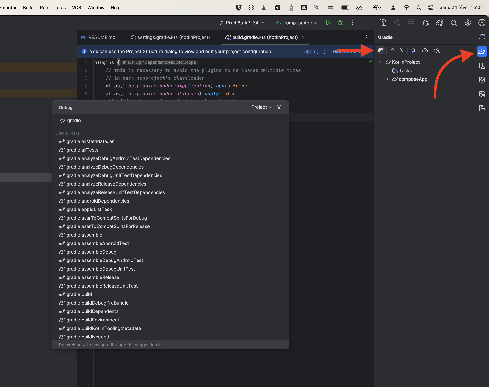

Dans cette fenêtre, nous voyons que nous avons plusieurs tâches disponibles :

Lancement de l'application de bureau :

```sh
gradle :composeApp:run
```

Pour les autres plateformes, pas besoin de lancer une tâche spécifique :


::: tip Le résultat

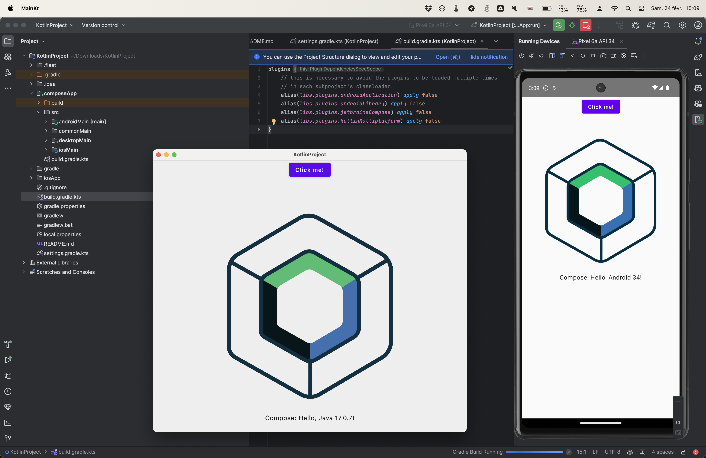

:::

## Les fichiers de configuration

Maintenant que nous avons lancé notre application, nous allons rentrer dans le détail des fichiers de configuration. En effet, Compose Multiplateform n'est qu'une base de code, pour réaliser nos applications de manière efficace, nous allons devoir ajouter des dépendances, des configurations, etc.

### composeApp/build.gradle.kts

Ce fichier est **le plus important** de tous, il va contenir les configurations spécifiques et les dépendances. La partie la plus intéressante de ce fichier est la partie `sourceSets` :

```kotlin
sourceSets {
        val desktopMain by getting
        
        androidMain.dependencies {
            implementation(libs.compose.ui.tooling.preview)
            implementation(libs.androidx.activity.compose)
        }
        
        commonMain.dependencies {
            implementation(compose.runtime)
            implementation(compose.foundation)
            implementation(compose.material)
            implementation(compose.ui)
            @OptIn(ExperimentalComposeLibrary::class)
            implementation(compose.components.resources)
        }

        desktopMain.dependencies {
            implementation(compose.desktop.currentOs)
        }
    }
```

Dans le code que vous avez généré, nous avons le minimum pour faire fonctionner notre application. Vous avez dans le code ci-dessus les dépendances de chaque plateforme. En fonction des problèmes, nous allons ajouter des dépendances soit dans la partie `commonMain` (si la dépendance est commune à toutes les plateformes), soit dans la partie spécifique à la plateforme (Android, iOS, Desktop).

Nous avons deux types de dépendances :

- `libs.…` : Ce sont des dépendances spécifiques à Compose Multiplateform. Elles sont définies dans le fichier `gradle/libs.versions.toml`.
- `compose.…` : Ce sont des dépendances spécifiques à Compose, elle ne sont pas défini dans notre application mia via le plugin Compose Multiplateform (pas celui installé dans Android Studio, mais celui qui est dans le fichier `build.gradle.kts`).

::: tip Remarque

Cette différence est importante, en effet, pour que notre application fonctionne. Jetbrains maintient une sorte de structure de dépendances compatible, un mauvais choix ? Et votre application ne compile plus.

Ça paraît contraignant, mais c'est en réalité une très bonne chose comme nous allons le voir par la suite.

:::

### gradle/libs.versions.toml

Vous avez remarqué ? Non ? Vraiment ? Bon, je vous guide alors… Dans la partie `sourceSets` nous avons des dépendances mais jamais de version. C'est normal, cette écriture est la nouvelle façon de déclarer nos dépendances. Elle simplifie la lecture du fichier `build.gradle.kts` et permet de centraliser les versions des dépendances dans le fichier `gradle/libs.versions.toml`.

```toml
[versions]
# Déclaration des versions 

[libraries]
# Déclaration des dépendances

[plugins]
# Déclaration des plugins
```

Dans ce toml, nous avons trois sections :

- `versions` : Cette section va contenir les versions des dépendances. C'est ici que nous allons déclarer les versions des dépendances que nous allons utiliser dans notre application.
- `libraries` : Cette section va contenir les dépendances. Quelle que soit la plateforme, nous allons déclarer ici les dépendances que nous allons utiliser.
- `plugins` : Cette section va contenir les plugins. C'est ici que nous allons déclarer les plugins que nous allons utiliser dans notre application.

Concrètement, voici un exemple :

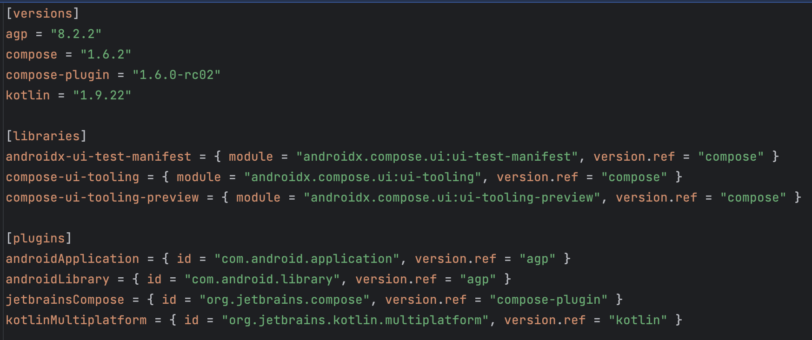

Dans cette exemple nous avons déclaré :

- Les versions des dépendances (Compose, AGP, etc.).
- Les dépendances (androidx-ui-test-manifest, compose-ui-tooling, etc.).
- Les plugins (androidApplication, androidLibrary, etc.).

::: tip Remarque

Il est important de comprendre que ce fichier est centralisé, c'est-à-dire que toutes les plateformes vont utiliser les mêmes versions de dépendances. C'est une très bonne chose, car cela permet de garantir une certaine compatibilité entre les différentes plateformes.

:::

### Évolution des versions

Avant de continuer notre exploration, je vous propose de basculer certaines dépendances vers des versions plus récentes :

```
compose = "1.6.2"
compose-plugin = "1.6.0-rc02"
```

Et également ajouter quelques dépendances :

```toml
[version]
koin = "3.6.0-wasm-alpha2"
precompose = "1.6.0-beta01"
ktorClient = "2.3.8"

[libraries]
koin = { module = "io.insert-koin:koin-core", version.ref = "koin" }
koin-compose = { module = "io.insert-koin:koin-compose", version.ref = "koin" }
koin-android = { module = "io.insert-koin:koin-android", version.ref = "koin" }
ktor-client-cio = { module = "io.ktor:ktor-client-cio", version.ref = "ktorClient" }
ktor-client-core = { module = "io.ktor:ktor-client-core", version.ref = "ktorClient" }
ktor-client-mock = { module = "io.ktor:ktor-client-mock", version.ref = "ktorClient" }
precompose = { module = "moe.tlaster:precompose", version.ref = "precompose" }
precompose-koin = { module = "moe.tlaster:precompose-koin", version.ref = "precompose" }
precompose-viewmodel = { module = "moe.tlaster:precompose-viewmodel", version.ref = "precompose" }
```

Je vous laisse déclarer ces dépendances dans le fichier de version (`gradle/libs.versions.toml`). Et les déclarer dans la partie `sourceSets` du fichier `composeApp/build.gradle.kts`.

```kotlin
commonMain.dependencies {
    // Dépendances communes à ajouter
    api(libs.koin)
    api(libs.koin.compose)
    api(libs.precompose)
    api(libs.precompose.viewmodel)
    api(libs.precompose.koin)
    api(libs.ktor.client.core)
    api(libs.ktor.client.cio)
}
```

::: tip Remarque
Pourquoi mettre des versions alpha ? Ça bouge vite, et si nous voulons bénéficier des dernières fonctionnalités, il est important de suivre les versions. Cependant, il est important de comprendre que les versions alpha sont instables, il est donc possible que votre application ne compile plus. C'est un choix à faire.

La version 1.6.0 ajoute le support de WASM et une amélioration de la gestion des ressources, elle est donc très intéressante pour nous.
:::

## L'approche multi-plateforme first

Il y a plusieurs façons d'imaginer une application multi-plateforme, pour moi la plus efficace est de penser « comment je peux faire pour que mon code soit le plus commun possible ? ». C'est une approche qui demande un peu de réflexion, mais qui est très efficace.

En effet, une fois que nous avons compris que le code commun est le plus important, nous allons chercher à réduire au maximum les variations d'implémentation entre les plateformes.

Cette façon de faire permet :

- De limiter la répétition de code.
- S'assurer que le visuel est le plus proche possible de la maquette.
- S'assurer que le visuel est le plus proche possible entre les plateformes.

**En résumé**, essayer de coder « comme avant », est l'erreur à ne pas commettre.

### Un exemple

Prenons un exemple, simple, vous souhaitez afficher par exemple la caméra de l'utilisateur. La manière de faire sera forcément différente en fonction de la plateforme. Vous pourriez être tenté de créer un composant « CameraScreen » qui serait à implémenter pour chaque plateforme.

#### La mauvaise façon de faire

```kotlin
@Composable
expect fun CameraScreen()
```

Puis dans chaque plateforme :

```kotlin
@OptIn(ExperimentalResourceApi::class)
@Composable
actual fun ScanScreen() {
    Box(modifier = Modifier.fillMaxSize()) {

        /**
            Le code spécifique à Android
            …
            Très long, avec la gestion des permissions, etc.
        **/


        Column(
            modifier = Modifier.fillMaxSize().padding(24.dp),
            verticalArrangement = Arrangement.Center,
            horizontalAlignment = Alignment.CenterHorizontally
        ) {
            Spacer(modifier = Modifier.weight(1f))
            Image(
                modifier = Modifier.testTag("scanArea"),
                painter = painterResource(DrawableResource("drawable/scan_area.xml")),
                contentDescription = "Scan Area"
            )
            Spacer(modifier = Modifier.weight(1f))

            OutlinedButton(
                modifier = Modifier.fillMaxWidth().testTag("manualButton"),
                onClick = {},
                text = "Enter the code manually"
            )
        }
    }
}
```

::: danger Attention

Procéder de cette manière serait en réalité une erreur. En faisant comme cela, nous allons créer des composants pour chaque plateforme avec énormément de code « d'interface », donc avec un risque de divergence entre les plateformes.

:::

#### La « bonne façon de faire »

Alors qu'en réalité, si nous inversons la logique, nous allons d’abord créer un composant commun, ce composant doit être le plus « fonctionnel » possible, c'est-à-dire qu'il doit être capable de fonctionner sur toutes les plateformes.

J'ai même envie de dire qu'il doit pouvoir fonctionner (sans afficher la caméra évidemment), dans cette façon de procéder, notre composant pourrait ressembler à :

```kotlin
@Composable
expect fun CameraView()

@OptIn(ExperimentalResourceApi::class)
@Composable
fun ScanScreen() {
    Box(modifier = Modifier.fillMaxSize()) {
        CameraView()

        Column(
            modifier = Modifier.fillMaxSize().padding(24.dp),
            verticalArrangement = Arrangement.Center,
            horizontalAlignment = Alignment.CenterHorizontally
        ) {
            Spacer(modifier = Modifier.weight(1f))
            Image(
                modifier = Modifier.testTag("scanArea"),
                painter = painterResource(DrawableResource("drawable/scan_area.xml")),
                contentDescription = "Scan Area"
            )
            Spacer(modifier = Modifier.weight(1f))

            OutlinedButton(
                modifier = Modifier.fillMaxWidth().testTag("manualButton"),
                onClick = {},
                text = "Enter the code manually"
            )
        }
    }
}
```

::: details L'implémentation Android

```kotlin
@Composable
actual fun CameraView() {
    val context = LocalContext.current
    val lifecycleOwner = LocalLifecycleOwner.current
    var preview by remember { mutableStateOf<Preview?>(null) }

    val cameraProviderFuture: ListenableFuture<ProcessCameraProvider> = ProcessCameraProvider.getInstance(context)
    DisposableEffect(cameraProviderFuture) {
        onDispose {
            cameraProviderFuture.get().unbindAll()
        }
    }

    var hasCamPermission by remember {
        mutableStateOf(
            ContextCompat.checkSelfPermission(
                context,
                Manifest.permission.CAMERA
            ) == PackageManager.PERMISSION_GRANTED
        )
    }
    val launcher = rememberLauncherForActivityResult(
        contract = ActivityResultContracts.RequestPermission(),
        onResult = { granted ->
            hasCamPermission = granted
        }
    )
    LaunchedEffect(key1 = true) {
        launcher.launch(Manifest.permission.CAMERA)
    }
    if (hasCamPermission) {
        AndroidView(
            factory = { AndroidViewContext ->
                PreviewView(AndroidViewContext).apply {
                    this.scaleType = PreviewView.ScaleType.FILL_CENTER
                    layoutParams = ViewGroup.LayoutParams(
                        ViewGroup.LayoutParams.MATCH_PARENT,
                        ViewGroup.LayoutParams.MATCH_PARENT,
                    )
                    implementationMode = PreviewView.ImplementationMode.COMPATIBLE
                }
            },
            modifier = Modifier.fillMaxSize(),
            update = { previewView ->
                val cameraSelector: CameraSelector = CameraSelector.Builder()
                    .requireLensFacing(CameraSelector.LENS_FACING_BACK)
                    .build()
                val cameraExecutor: ExecutorService = Executors.newSingleThreadExecutor()

                cameraProviderFuture.addListener({
                    preview = Preview.Builder().build().also {
                        it.setSurfaceProvider(previewView.surfaceProvider)
                    }
                    val cameraProvider: ProcessCameraProvider = cameraProviderFuture.get()
                    
                    try {
                        cameraProvider.unbindAll()
                        cameraProvider.bindToLifecycle(
                            lifecycleOwner,
                            cameraSelector,
                            preview,
                            imageAnalysis
                        )
                    } catch (e: Exception) {
                        e.printStackTrace()
                        Log.e("qr code", e.message ?: "")
                    }
                }, ContextCompat.getMainExecutor(context))
            }
        )
    }
}
```

:::

::: details L'implémentation iOS

```kotlin
package ui.scan

import androidx.compose.foundation.background
import androidx.compose.foundation.layout.*
import androidx.compose.material3.Text
import androidx.compose.runtime.*
import androidx.compose.ui.Alignment
import androidx.compose.ui.Modifier
import androidx.compose.ui.graphics.Color
import androidx.compose.ui.interop.UIKitView
import kotlinx.cinterop.CValue
import kotlinx.cinterop.ExperimentalForeignApi
import kotlinx.cinterop.ObjCAction
import platform.AVFoundation.*
import platform.AVFoundation.AVCaptureDeviceDiscoverySession.Companion.discoverySessionWithDeviceTypes
import platform.AVFoundation.AVCaptureDeviceInput.Companion.deviceInputWithDevice
import platform.AudioToolbox.AudioServicesPlaySystemSound
import platform.AudioToolbox.kSystemSoundID_Vibrate
import platform.CoreGraphics.CGRect
import platform.Foundation.NSNotification
import platform.Foundation.NSNotificationCenter
import platform.Foundation.NSSelectorFromString
import platform.QuartzCore.CATransaction
import platform.QuartzCore.kCATransactionDisableActions
import platform.UIKit.UIDevice
import platform.UIKit.UIDeviceOrientation
import platform.UIKit.UIView
import platform.darwin.NSObject
import platform.darwin.dispatch_get_main_queue

// Source :
// https://gist.github.com/oianmol/77b84e498ca0210632ad2f3523c08752

private sealed interface CameraAccess {
    object Undefined : CameraAccess
    object Denied : CameraAccess
    object Authorized : CameraAccess
}

private val deviceTypes = listOf(
    AVCaptureDeviceTypeBuiltInWideAngleCamera,
    AVCaptureDeviceTypeBuiltInDualWideCamera,
    AVCaptureDeviceTypeBuiltInDualCamera,
    AVCaptureDeviceTypeBuiltInUltraWideCamera,
    AVCaptureDeviceTypeBuiltInDuoCamera
)

@Composable
actual fun CameraView() {
    var cameraAccess: CameraAccess by remember { mutableStateOf(CameraAccess.Undefined) }
    LaunchedEffect(Unit) {
        when (AVCaptureDevice.authorizationStatusForMediaType(AVMediaTypeVideo)) {
            AVAuthorizationStatusAuthorized -> {
                cameraAccess = CameraAccess.Authorized
            }

            AVAuthorizationStatusDenied, AVAuthorizationStatusRestricted -> {
                cameraAccess = CameraAccess.Denied
            }

            AVAuthorizationStatusNotDetermined -> {
                AVCaptureDevice.requestAccessForMediaType(
                    mediaType = AVMediaTypeVideo
                ) { success ->
                    cameraAccess = if (success) CameraAccess.Authorized else CameraAccess.Denied
                }
            }
        }
    }

    AuthorizedCamera()
}

@Composable
private fun AuthorizedCamera() {
    val camera: AVCaptureDevice? = remember {
        discoverySessionWithDeviceTypes(
            deviceTypes = deviceTypes,
            mediaType = AVMediaTypeVideo,
            position = AVCaptureDevicePositionBack,
        ).devices.firstOrNull() as? AVCaptureDevice
    }
    if (camera != null) {
        RealDeviceCamera(camera)
    } else {
        Text(
            """
            Camera is not available on simulator.
            Please try to run on a real iOS device.
            """.trimIndent(), color = Color.White
        )
    }
}

@OptIn(ExperimentalForeignApi::class)
@Composable
private fun RealDeviceCamera(camera: AVCaptureDevice) {
    val capturePhotoOutput = remember { AVCapturePhotoOutput() }
    var actualOrientation by remember {
        mutableStateOf(
            AVCaptureVideoOrientationPortrait
        )
    }


    val captureSession: AVCaptureSession = remember {
        AVCaptureSession().also { captureSession ->
            captureSession.sessionPreset = AVCaptureSessionPresetPhoto
            val captureDeviceInput: AVCaptureDeviceInput = deviceInputWithDevice(device = camera, error = null)!!
            captureSession.addInput(captureDeviceInput)
        }
    }

    val cameraPreviewLayer = remember {
        AVCaptureVideoPreviewLayer(session = captureSession)
    }

    DisposableEffect(Unit) {
        class OrientationListener : NSObject() {
            @Suppress("UNUSED_PARAMETER")
            @ObjCAction
            fun orientationDidChange(arg: NSNotification) {
                val cameraConnection = cameraPreviewLayer.connection
                if (cameraConnection != null) {
                    actualOrientation = when (UIDevice.currentDevice.orientation) {
                        UIDeviceOrientation.UIDeviceOrientationPortrait ->
                            AVCaptureVideoOrientationPortrait

                        UIDeviceOrientation.UIDeviceOrientationLandscapeLeft ->
                            AVCaptureVideoOrientationLandscapeRight

                        UIDeviceOrientation.UIDeviceOrientationLandscapeRight ->
                            AVCaptureVideoOrientationLandscapeLeft

                        UIDeviceOrientation.UIDeviceOrientationPortraitUpsideDown ->
                            AVCaptureVideoOrientationPortrait

                        else -> cameraConnection.videoOrientation
                    }
                    cameraConnection.videoOrientation = actualOrientation
                }
                capturePhotoOutput.connectionWithMediaType(AVMediaTypeVideo)
                    ?.videoOrientation = actualOrientation
            }
        }

        val listener = OrientationListener()
        val notificationName = platform.UIKit.UIDeviceOrientationDidChangeNotification
        NSNotificationCenter.defaultCenter.addObserver(
            observer = listener,
            selector = NSSelectorFromString(
                OrientationListener::orientationDidChange.name + ":"
            ),
            name = notificationName,
            `object` = null
        )
        onDispose {
            NSNotificationCenter.defaultCenter.removeObserver(
                observer = listener,
                name = notificationName,
                `object` = null
            )
        }
    }
    UIKitView(
        modifier = Modifier.fillMaxSize(),
        background = Color.Black,
        factory = {
            val cameraContainer = UIView()
            cameraContainer.layer.addSublayer(cameraPreviewLayer)
            cameraPreviewLayer.videoGravity = AVLayerVideoGravityResizeAspectFill
            captureSession.startRunning()
            cameraContainer
        },
        onRelease = {
            if (captureSession.isRunning()) {
                captureSession.stopRunning()
            }
        },
        onResize = { view: UIView, rect: CValue<CGRect> ->
            CATransaction.begin()
            CATransaction.setValue(true, kCATransactionDisableActions)
            view.layer.setFrame(rect)
            cameraPreviewLayer.setFrame(rect)
            CATransaction.commit()
        },
    )
}
```

:::

::: tip La différence semble minime

À première vue, la différence semble minime, mais en réalité, c'est loin d'être le cas.

Si vous observez bien, dans la partie multiplateforme, nous avons globalement que la partie « interface » et dans le code Android, nous n'avons pas d'élément d'interface, mais uniquement la gestion de la caméra.

:::

### Les mots clés `expect` et `actual`

Dans le code précédent, nous avons utilisé les mots clés `expect` et `actual`. Ce sont des mots clés spécifiques à la gestion du multiplateforme en Kotlin. Ils permettent de déclarer une fonction qui doit être implémentée dans une autre plateforme.

- `expect` : Ce mot clé est utilisé pour déclarer une fonction qui doit être implémentée dans une autre plateforme.
- `actual` : Ce mot clé est utilisé pour implémenter une fonction déclarée avec le mot clé `expect`.

Une fois un morceau de code déclaré avec le mot clé `expect`, **vous devrez** l'implémenter dans chaque plateforme. Cette syntaxe s'applique également aux classes, aux propriétés, etc.

Exemple :

```kotlin
// Méthode permettant de récupérer la route par défaut, elle doit être implémentée dans chaque plateforme
expect fun getDefaultRoute(): String

// Méthode permettant de retourner un module Koin permettant de gérer le stockage, elle doit être implémentée dans chaque plateforme
expect fun storageModule(): Module

// Classe permettant de standardiser la gestion du stockage, elle doit être implémentée dans chaque plateforme
expect open class LocalStorage : ILocalStorage{
    override fun save(key: String, value: String)
    override fun get(key: String): String
    override fun remove(key: String)
    override fun clear()
}
```

Le mot clé `expect` est la réelle force du langage Kotlin, c'est avec lui que nous allons pouvoir créer des applications multiplateformes efficaces.

::: danger Attention

C'est une force si vous l'utilisez de manière intelligente, c'est-à-dire en ciblant pour garder au maximum le code commun. Personnellement, je commence toujours par écrire le code commun (sans `excpect` donc), puis je regarde par la suite ce qui doit être spécifié par plateforme.

Keep it simple comme dirais l'autre…

<center>
    <iframe src="https://giphy.com/embed/TSokjMYhJAZRMqExC2" width="480" height="270" frameBorder="0" class="giphy-embed" allowFullScreen></iframe>
</center>

:::

### Les ressources

Comme pour le code, j'ai envie de dire que les ressources doivent être les plus communes possibles ! J'ai bien l'impression que c'est la même chose pour JetBrain, les ressources sont en effet centralisées dans le dossier `composeApp/src/commonMain/resources`.

Jusqu'à la version 1.6.0, les ressources étaient très librement gérées, mais avec la version 1.6.0, JetBrain a introduit une nouvelle manière de gérer les ressources (pas de dossier en particulier autre que `commonMain/resources`). Depuis la version 1.6.0, cette gestion est maintenant plus structurée et très proche de ce que nous pouvons trouver dans une application Android classique.

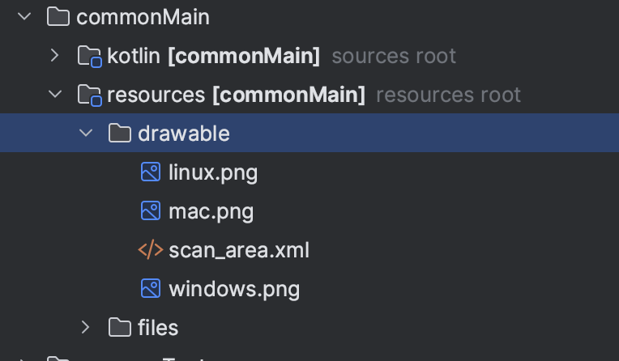

Voir la documentation officielle pour plus d'informations : <https://www.jetbrains.com/help/kotlin-multiplatform-dev/compose-images-resources.html>

### C'est à vous

Avec les éléments que nous avons vus. Je vous propose de modifier votre application pour ajouter la fameuse Caméra. Vous pouvez utiliser la librairie [CameraX](https://developer.android.com/training/camerax) pour Android, et pour iOS, vous pouvez utiliser la librairie [AVFoundation](https://developer.apple.com/documentation/avfoundation/cameras_and_media_capture).

## `precompose`

Et bien voilà, nous y sommes, nous avons vu les éléments de bases pour créer une application Compose Multiplateform. C'est bien, mais notre application est très simple (un seul écran), et nous n'avons pas encore vu la navigation, la gestion des états, etc.

C'est ici que `precompose` intervient. Sur une application Android classique, nous aurions utilisé `Jetpack` pour gérer la navigation, la gestion des états, etc. Cependant, même si Google est très actif sur le multi-plateforme, il n'est pas pour l'instant possible d'utiliser les éléments comme la navigation sur autre chose qu'Android.

::: tip est-ce que ça changera ?

Pour l'instant ça ne semble pas être le cas. En effet, il ne faut pas oublier que Compose Multiplateform est développé par JetBrains et non par Google. Les deux mondes vont donc se rapprocher petit à petit. Mais je doute très fortement que Google mette à disposition des éléments centraux de Jetpack pour le multi-plateforme.

:::

Il existe plusieurs librairies pour gérer la navigation, la gestion des états, etc, [Jetbrains, les liste d'ailleurs sur leur documentation](https://www.jetbrains.com/help/kotlin-multiplatform-dev/compose-navigation-routing.html), toutes sont très bien, certaines vont très loin voir plus loin que Jetpack. Après avoir passé un peu de temps à les tester (et à lire des retours d'expérience), j'ai choisi de travailler avec `precompose`. Cette librairie est très simple à prendre en main, elle est très proche (voir identique) à ce que nous pouvons trouver dans Jetpack.

Vous pouvez consulter la documentation de `precompose` ici : [https://tlaster.github.io/PreCompose/](https://tlaster.github.io/PreCompose/)

### Ajouter `precompose`

Nous avons déjà ajouté `precompose` dans notre fichier de version, il est maintenant temps de l'ajouter dans notre application. Pour tester `precompose`, nous allons restructurer notre application pour y inclure un `NavHost` et y définir des routes.

::: tip Remarque

N'oubliez pas de synchroniser votre projet pour récupérer les dépendances.

:::

### Modifier la structure de notre application

Pour ajouter `precompose`, nous allons modifier le fichier `composeApp/src/commonMain/kotlin/App.kt` :

```kotlin
@Composable
@ExperimentalTransitionApi
fun App() {
    PreComposeApp {
        val navigator = rememberNavigator()

        YourApplicationTheme {
            NavHost(
                navigator = navigator,
                initialRoute = "/"
            ) {
                scene("/") {
                    MainRoute {
                        navigator.navigate(route = "/second")
                    }
                }

                scene("/second") {
                    HelloRoute {
                        navigator.navigate(route = "/")
                    }
                }
            }
        }
    }
}
```

Si vous avez bien suivi, nous avons modifié la structure de notre application pour y inclure un `NavHost` et des `scene`. Mais nous avons également commencé à structurer notre application en créant un `YourApplicationTheme` qui va contenir l'ensemble des éléments de style de notre application ainsi que le Scaffold.

::: tip Un instant

Avant de parler du `YourApplicationTheme`, arrêtons-nous un instant sur les `…Route`. Découper le `Screen` de la `Route` nous permettra de gérer plus facilement la partie Tests et également l'injection de dépendances.

:::

Donc, dans mon cas, le fichier `YourApplicationTheme` ressemble à :

```kotlin
@Composable
fun YourApplicationTheme(content: @Composable () -> Unit) {
    MaterialTheme {
        Scaffold(
            topBar = {
                TopAppBar(
                    title = {
                        Text("Demo App")
                    }
                )
            }
        ) { innerPadding ->
            Box(modifier = Modifier.padding(innerPadding)) {
                content()
            }
        }
    }
}
```

Qu'avons-nous ici ?

- `MaterialTheme` : C'est le thème de base de notre application, il va contenir l'ensemble des éléments de style de notre application. Nous n'avons aucune personnalisation ici, mais il est possible de le faire.
- `Scaffold` : C'est le conteneur principal de notre application, il va contenir l'ensemble des éléments de notre application. Ici, nous avons un `TopAppBar` qui va contenir le titre de notre application.
- Le seul contenu de notre `Scaffold` est un `Box` qui va contenir l'ensemble des éléments de notre application (ici, notre `NavHost`).

::: danger Comment ranger les fichiers ?

Évidemment vous pouvez ranger les fichiers comme vous le souhaitez, mais je vous conseille de ranger les fichiers de la manière suivante :

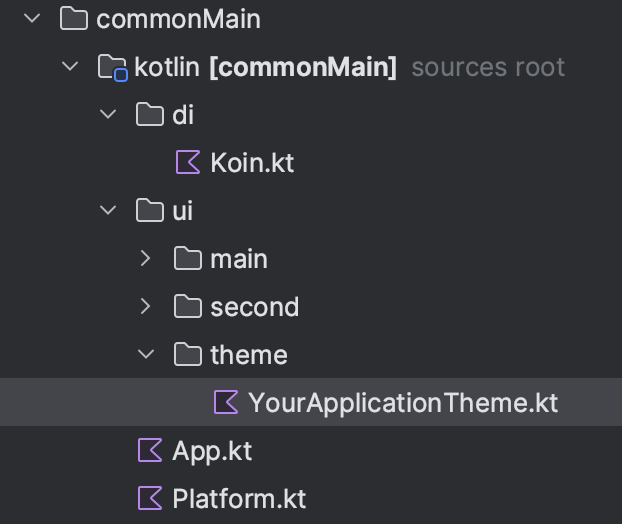

Pourquoi ce rangement ? Organiser son code en package est une bonne pratique, l'organiser avec au minimum des packages `ui`, `di`, `data` est une très bonne pratique. Cela permet de séparer les éléments de l'interface, de la gestion des états, et de la gestion des données. De plus, elle permettra à n'importe qui de comprendre rapidement l'organisation de votre application afin d'y apporter des correctifs ou des améliorations.

:::

### Créer les composants `MainRoute` et `HelloRoute`

Avant de continuer, nous allons créer deux composants `MainRoute` et `HelloRoute`, ils auront pour vocation de simuler deux écrans différents. Le rendu final de mon application ressemble à :

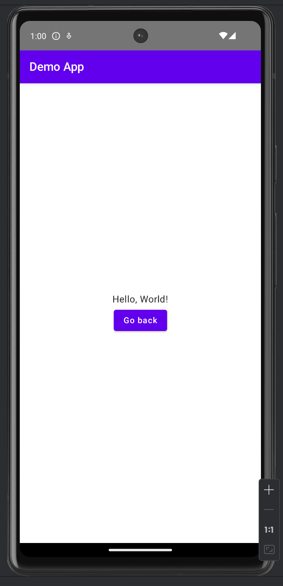


::: tip C'est à vous

Je vous laisse créer ces deux composants. Puis tester votre application à la fois sur Android et sur Desktop.

:::

::: details Vous débutez en Compose ?

Voici un exemple de composant `MainRoute` :

```kotlin
@Composable
fun MainRoute(onClick: () -> Unit) {
    MainScreen(onClick)
}

@Composable
fun MainScreen(onClick: () -> Unit) {
    Column(
        modifier = Modifier.fillMaxSize().padding(24.dp),
        verticalArrangement = Arrangement.Center,
        horizontalAlignment = Alignment.CenterHorizontally
    ) {
        Button(onClick = onClick) {
            Text("Go to second screen")
        }
    }
}
```

:::

### Définir nos routes

Pour l'instant nous avons créé des routes en « dur » directement dans le code. Techniquement ça fonctionne, mais ce n’est globalement pas très pratique. Par exemple, si nous souhaitons avoir des routes dynamiques en fonction de la plateforme (par exemple, une route pour la caméra), nous allons devoir modifier le code à chaque fois.

Avec une simple adaptation de notre code, nous pouvons passer via une enum pour définir nos routes :

```kotlin
enum class Route(val path: String) {
    Default(getDefaultRoute()),
    Main("/"),
    Hello("/hello"),
    Scan("/scan")
}

expect fun getDefaultRoute(): String
```

À partir de maintenant nous pouvons modifier notre `NavHost` pour utiliser cette enum :

```kotlin
NavHost(
    navigator = navigator,
    initialRoute = Route.Default.path
) {
    scene(Route.Main.path) {
        MainRoute {
            navigator.navigate(route = Route.Hello.path)
        }
    }

    scene(Route.Hello.path) {
        HelloRoute {
            navigator.navigate(route = Route.Default.path)
        }
    }
}
```

L'avantage de rendre les routes « déclaratives » est que nous améliorons la lisibilité de notre code, mais ça nous offre également une certaines souplesse, en effet nous pouvons maintenant définir des routes dynamiques en fonction de la plateforme.

Avant de vous laisser implémenter cette enum, n'oubliez pas l'organisation de vos fichiers. Dans mon cas, j'ai créé un fichier `Route.kt` dans le package `navigation` :


::: tip C'est à vous

Je vous laisse modifier votre application pour utiliser cette enum. Puis tester votre application à la fois sur Android et sur Desktop.

:::

### Définir un point d'entrée différent par plateforme

Pourquoi est-ce intéressant de définir un point d'entrée différent par plateforme ? C'est une question que vous pouvez vous poser, et c'est une très bonne question.

Dans notre code, pour l'instant nous arrivons sur la vue « MainRoute », c'est bien, mais si là je vous demandais que notre route principale soit la vue « ScanRoute » ? 

La particularité de la vue ScanRoute est qu'elle n'est pas disponible sur Desktop (sauf si vous avez implémenté la caméra sur Desktop). Dans ce cas, nous devons rendre notre route principale dynamique en fonction de la plateforme. Et c'est ici que les mots clés `expect` et `actual` vont nous aider.

Pour commencer, nous avons déclaré une fonction `getDefaultRoute` :

```kotlin
expect fun getDefaultRoute(): String
```

Pour l'instant, nous indiquons juste que cette fonction doit être implémentée dans chaque plateforme. Nous allons maintenant l'implémenter dans chaque plateforme.

Je vous laisse implémenter cette fonction dans chaque plateforme. Pour Android, vous pouvez utiliser la route `/scan`, pour Desktop, vous pouvez utiliser la route `/`.

N'oubliez pas que AndroidStudio / Fleet est rempli de petits raccourcis pour vous aider à implémenter ces fonctions :


Puis :

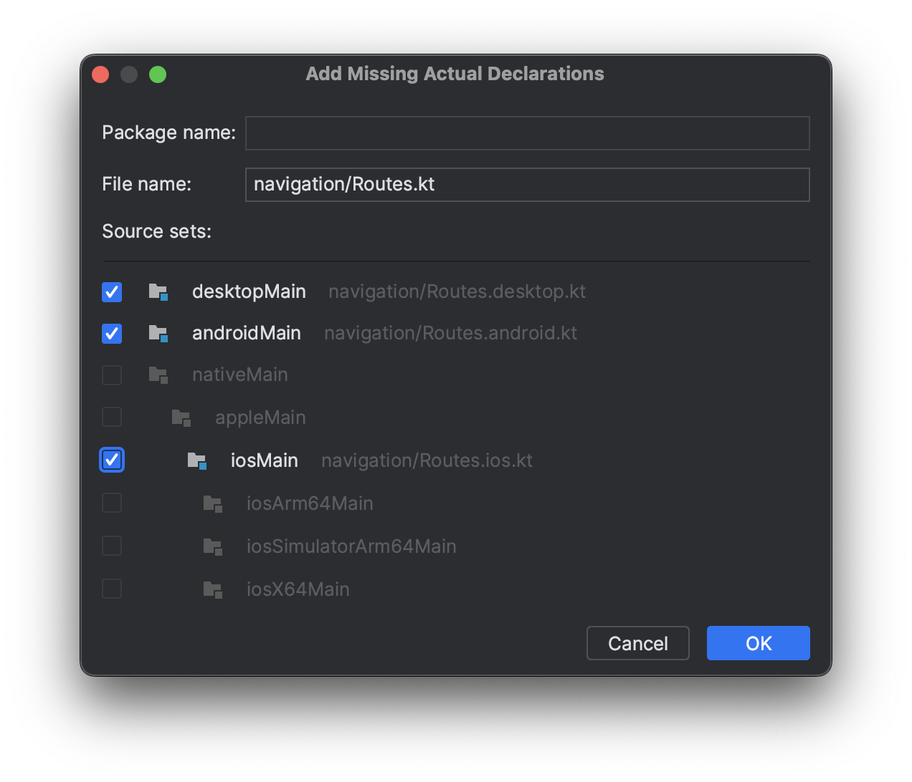

## Conclusion intermédiaire

Nous avons vu les bases du développement d'une application Compose Multiplateform. Si vous avez bien suivi, vous avez compris que l'important est d'avoir une approche « multiplateforme first », c'est-à-dire de penser à réduire au maximum les différences d'implémentation entre les plateformes.

Si vous respectez ce principe, vos applications seront plus simples à maintenir, plus simples à tester, et plus simples à améliorer.

Nous allons attaquer la suite :

- Koin : Pour la gestion des dépendances.
- ktor : Pour la gestion des appels réseau.
- Les ViewModels : Pour la gestion des états.

## Koin

Il est clairement possible de faire du code pendant des années sans jamais avoir entendu parler d'injection de dépendances. Ce terme barbare était autrefois assez compliqué à mettre en place, mais avec l'arrivée de Koin, c'est devenu un jeu d'enfant (presque ok…).

::: tip Point terminologie

L'injection de dépendances est un concept qui permet de séparer la création d'un objet de son utilisation. Cela permet de rendre le code plus modulaire, plus testable, et plus facile à maintenir.

Grâce à l'injection de dépendances, nous allons pouvoir créer des objets qui vont être utilisés dans notre application. Au moment de l'instanciation de notre objet, nous ne savons pas encore de quelle manière il sera utilisé. C'est bien plus tard, dans votre code, que vous allez utiliser cet objet (par exemple dans un ViewModel).

:::

### Une configuration centralisée

Comme pour les Composants d'interface, nous allons chercher à centraliser au maximum la configuration de nos dépendances. C'est-à-dire que nous allons penser `CommonFirst` avant de penser `PlatformFirst`.

Cette gymnastique de l'esprit est importante, je vous invite vivement à le faire.

Dans notre application, nous allons donc créer un package `di` dans lequel nous allons déclarer l'ensemble de nos dépendances. Dans mon cas, j'ai créé un fichier `Koin.kt` :

```kotlin
fun setupKoin() = startKoin {
    modules(platformSpecificModule())
}

expect fun platformSpecificModule(): Module
```

Dans ce fichier, nous avons déclaré une fonction `setupKoin` qui va permettre de démarrer Koin. Cette fonction va également charger les modules spécifiques à chaque plateforme. Évidemment, nous allons devoir implémenter cette fonction dans chaque plateforme.

L'autre point important, c'est que pour l'instant nous n'avons pas démarré Koin, donc rien ne sera injecté dans notre application. Pour activer Koin nous allons devoir :

- Indiquer que notre application va utiliser Koin (dans le fichier `App.kt`).
- Démarrer Koin (dans le fichier `MainApplication.kt` pour Android, dans le fichier `Main.kt` pour Desktop).

### Indiquer que notre application va utiliser Koin

Pour indiquer que notre application va utiliser Koin, nous allons devoir modifier notre fichier `App.kt` :

```kotlin
@Composable
@ExperimentalTransitionApi
fun App() {
    PreComposeApp {
        KoinContext {
            // Le reste de notre application
        }
    }
}
```

À partir de maintenant, si vous lancez votre application sans rien toucher vous devriez avoir une erreur :


Et oui, nous n'avons pas démarré Koin, c'est ce que nous allons faire maintenant.

### Démarrer Koin

#### Desktop

Pour l'implémentation Desktop, nous allons devoir démarrer Koin dans le fichier `Main.kt` :

```kotlin
@OptIn(ExperimentalTransitionApi::class)
fun main() {
    setupKoin()
    
    application {
        val state = rememberWindowState(height = 800.dp, width = 500.dp)
        Window(onCloseRequest = ::exitApplication, title = "Kotlin Project", state = state, resizable = false) {
            App()
        }
    }
}
```

#### Android

Pour Android l'approche va être un peu différente, nous allons devoir démarrer Koin dans le fichier `MainApplication.kt` dans le package `src/androidMain/com…`. Pour l'instant vous n'avez pas ce fichier, il va falloir le créer. Voici un exemple de fichier `MainApplication.kt` :

```kotlin
class MainApplication : Application() {
    override fun onCreate() {
        super.onCreate()
        stopKoin()
        setupKoin().androidContext(this)
    }
}
```

Par rapport à l'implémentation Desktop, nous avons utilisé la fonction `androidContext`, cela va nous permettre de récupérer le contexte de notre application Android si nous en avons besoin.

Une fois ce fichier créé, n'oubliez pas de le déclarer dans le `AndroidManifest.xml` :

```xml
<application
    android:name=".MainApplication"
    …
    >
    …
</application>
```

Pour que le code fonctionne, vous allez également avoir besoin d'ajouter une dépendance dans votre fichier `build.gradle.kts` :

```kotlin
androidMain.dependencies {
    // Le reste de vos dépendances

    // Dépendance pour Koin Android
    implementation(libs.koin.android)
}
```

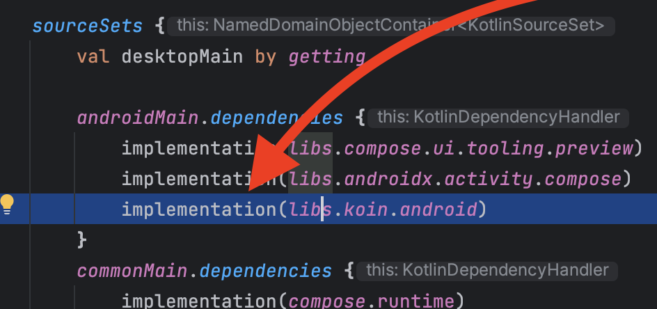

Si vous avez bien suivi, votre application devrait compiler sans erreur. Vous avez maintenant Koin de démarré dans votre application !

Bravo !

<iframe src="https://giphy.com/embed/l46Cd4qNHmnDI8Hks" width="480" height="480" frameBorder="0" class="giphy-embed" allowFullScreen></iframe>

### Des spécificités par plateforme

Dans notre partie commune, nous avons déclaré une fonction `platformSpecificModule` qui va permettre de charger les modules spécifiques à chaque plateforme. Nous allons maintenant l'implémenter dans chaque plateforme.

Pour l'instant il est vide :

```kotlin
actual fun platformSpecificModule() = module {}
```

Plus tard, nous pourrons y ajouter des dépendances spécifiques à chaque plateforme. Par exemple, pour Android, nous pourrions y ajouter une dépendance pour la gestion des appels réseau, pour Desktop, nous pourrions y ajouter une dépendance pour la gestion des fichiers.

## ktor

L'intérêt d'avoir un injecteur de dépendances est de pouvoir centraliser tous les éléments « réutilisables » de notre application. L'un des premiers qui peut-être intéressant est la centralisation de la gestion des appels réseaux.

Pour la gestion des appels réseau, nous allons utiliser `ktor`. C'est une librairie développée par JetBrains, elle est très simple à prendre en main, et elle est très puissante. Elle permet à la fois de faire des appels réseau, mais également de créer des serveurs. C'est une librairie très complète.

Nous avons dans notre setup initial déjà ajouté les dépendances pour `ktor`, nous allons maintenant l'implémenter dans notre application. Nous allons découper notre logique en différentes parties :

- Déclarer le module Koin pour la gestion des appels réseaux (`NetworkModule.kt` dans le dossier `di`).
- Déclarer le connecteur réseau (`NetworkDao.kt` dans le dossier `data.dao`).
- Une fois le connecteur réseau déclaré, nous allons pouvoir l'utiliser dans nos ViewModels.

### Déclarez-le `NetworkModule`

Pour déclarer le module Koin pour la gestion des appels réseaux, nous allons créer un fichier `NetworkModule.kt` dans le dossier `di` :

```kotlin
import io.ktor.client.HttpClient
import io.ktor.client.engine.cio.CIO
import io.ktor.client.plugins.HttpTimeout
import org.koin.dsl.module

val networkModule = module {
    single {
        HttpClient {
            CIO
            expectSuccess = true
            install(HttpTimeout) {
                requestTimeoutMillis = 30_000
                connectTimeoutMillis = 30_000
                socketTimeoutMillis = 30_000
            }
        }
    }
}
```

Dans ce fichier, nous avons déclaré un module Koin qui va permettre de créer un client HTTP. Ce client HTTP va être utilisé pour faire des appels réseau. Le client utilise le moteur `CIO` qui est le moteur par défaut de `ktor`.

### Déclarer le connecteur réseau dans Koin

Pour déclarer le connecteur réseau dans Koin, nous allons devoir modifier notre fichier `Koin.kt` :

```kotlin
fun setupKoin() = startKoin {
    modules(platformSpecificModule())
    modules(networkModule)
}
```

::: tip Qu'avons-nous fait ?

En déclarant le module `networkModule` dans notre fichier `Koin.kt`, nous rendons disponible le client HTTP à toutes les classes de notre application qui en feront la demande.

C'est pour ça que nous appelons ça un injecteur de dépendances, nous injectons des dépendances qui vont être utilisées plus tard dans notre application.

:::

### Déclarer le `NetworkOperation`

Pour l'instant notre client HTTP est triste, seul, il n'a pas d'amis… Nous allons lui créer un ami, nous allons créer un fichier `NetworkOperation.kt` dans le dossier `data.dao` :

```kotlin
class NetworkOperation(private val client: HttpClient) {
    suspend fun getHello(): String? {
        return try {
            client.get("https://raw.githubusercontent.com/c4software/bts-sio/master/hello.md").body<String>()
        } catch (e: Exception) {
            null
        }
    }
}
```

Notre DAO va permettre de faire des appels réseau. Pour l'instant nous avons une seule méthode `getHello` qui va permettre de récupérer un fichier `hello.md` sur mon dépôt GitHub.

Pour l'instant notre `NetworkOperation` n'est pas injecté dans notre application, nous allons devoir le faire.

### Injecter le `NetworkOperation` dans notre application

Pour injecter le `NetworkOperation` dans notre application, nous allons devoir modifier notre fichier `Koin.kt` :

```kotlin
fun setupKoin() = startKoin {
    modules(platformSpecificModule())
    modules(networkModule)
    modules(networkDaoModule)
}
```

C'est à partir de maintenant que la magie de Koin opère, nous allons pouvoir injecter notre `NetworkOperation` dans nos ViewModels. Et donc faire des appels réseau dans nos vues.

## Les ViewsModels

Les ViewModels sont des éléments centraux de notre application, ils vont permettre de gérer l'ensemble des états de notre application. Pour l'instant nous n'avons pas encore vu comment les implémenter, mais nous allons le faire maintenant.

`Precompose` Intègre le code permettant de gérer les ViewModels. Pour « tester » cette partie, nous allons créer un ViewModel qui va permettre de récupérer le contenu du fichier `hello.md` que nous avons récupéré précédemment.

### Créer le ViewModel

Nous allons ajouter un fichier `MainViewModel.kt` dans le package `ui.main` :

```kotlin
interface IMainViewModel {
    val isLoading: MutableStateFlow<Boolean>
    fun getHello()
}

class MainViewModel(private val networkOperation: NetworkOperation) : ViewModel(), IMainViewModel {
    override val isLoading: MutableStateFlow<Boolean> = MutableStateFlow(false)

    override fun getHello() {
        isLoading.value = true

        CoroutineScope(Dispatchers.Default).launch {
            // On affiche le résultat dans la console
            println(networkOperation.getHello())

            // On arrête le chargement
            isLoading.value = false
        }
    }
}
```

Pourquoi avons-nous créé une interface `IMainViewModel` ? C'est une très bonne question ! Créer une interface va nous permettre de tester notre ViewModel plus facilement. En effet, nous allons pouvoir créer un Mock de notre ViewModel pour tester notre application.

### Injecter le ViewModel dans notre application

Pour injecter le ViewModel dans notre application, nous allons devoir modifier notre fichier `Koin.kt` :

```kotlin
var daoModule = module {
    single { NetworkOperation(get()) }
}

val appModule = module {
    factory { MainViewModel(get()) }
}
```

::: danger Attention

Évidemment on n'oublie pas de ranger ces déclarations dans des fichiers séparés :

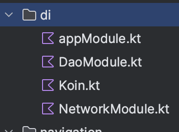

:::

Puis dans notre fichier `Koin.kt` :

```kotlin
fun setupKoin() = startKoin {
    modules(platformSpecificModule())
    modules(networkModule)
    modules(daoModule)
    modules(appModule)
}
```

### Utiliser le ViewModel dans notre Composant

Pour utiliser le ViewModel dans notre composant, nous allons devoir modifier notre composant `MainRoute` :

```kotlin
@Composable
fun MainRoute(onClick: () -> Unit) {
    val viewModel = koinViewModel(MainViewModel::class)
    val isLoading: Boolean by viewModel.isLoading.collectAsStateWithLifecycle()

    MainScreen(
        viewModel = viewModel,
        isLoading = isLoading,
        onClick = onClick
    )
}

@Composable
fun MainScreen(
    viewModel: IMainViewModel,
    isLoading: Boolean = false,
    onClick: () -> Unit
) {
    Column(
        modifier = Modifier.fillMaxSize().padding(24.dp),
        verticalArrangement = Arrangement.Center,
        horizontalAlignment = Alignment.CenterHorizontally
    ) {

        if (isLoading) {
            CircularProgressIndicator()
        }

        Button(onClick = onClick) {
            Text("Go to second screen")
        }

        Button(onClick = { viewModel.getHello() }) {
            Text("Get Hello")
        }
    }
}
```

Un peu de code, mais rien de bien compliqué. Nous avons utilisé la fonction `koinViewModel` pour récupérer notre ViewModel. Nous avons également utilisé `collectAsStateWithLifecycle` pour récupérer l'état de notre ViewModel.

Une fois ces deux variables disponibles, nous les passons en paramètre de notre composant `MainScreen`. Celui-ci va les utiliser pour afficher un `CircularProgressIndicator` si notre ViewModel est en train de charger, et un bouton pour récupérer le contenu du fichier `hello.md`.

::: tip C'est à vous

Je vous laisse modifier votre application pour utiliser le ViewModel. Puis tester votre application à la fois sur Android et sur Desktop.

:::

### En résumé

Beaucoup de code ? En réalité, pas tant que ça. Nous avons vu comment :

- Créer un ViewModel.
- Injecter le ViewModel dans notre application.
- Utiliser le ViewModel dans notre composant.
- Injecter différentes classes dans notre application (NetworkOperation, ViewModel).

Notre structure a un peu évolué, mais reste dans le moule de ce que nous avons vu précédemment :

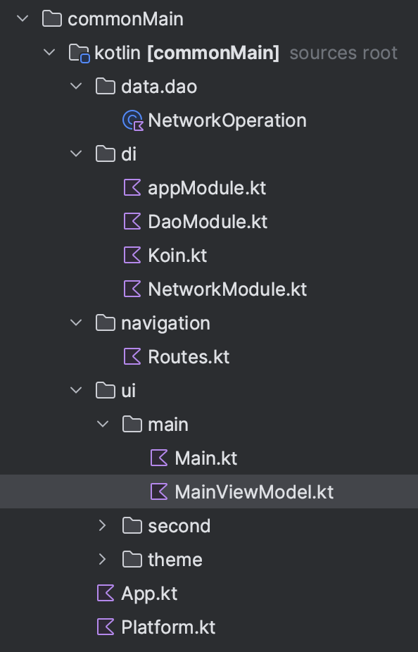

::: danger Point important

Vous noterez que nous n'avons pas écrit de code spécifique à chaque plateforme. C'est bien, c'est ce que nous cherchons à faire. Nous avons réussi à garder notre code commun, et à ne pas écrire de code spécifique à chaque plateforme.

:::

## Sauvegarder les données sur le téléphone

Pour sauvegarder des données sur le téléphone, nous allons devoir écrire du code spécifique à chaque plateforme. Pour ça nous allons utiliser à nouveau les mots clés `expect` et `actual`.

```kotlin
interface ILocalStorage {
    fun save(key: String, value: String)
    fun get(key: String): String
    fun remove(key: String)
    fun clear()
}

expect open class LocalStorage : ILocalStorage{
    override fun save(key: String, value: String)
    override fun get(key: String): String
    override fun remove(key: String)
    override fun clear()
}
```

```kotlin
expect fun storageModule(): Module
```

Grâce à ces deux éléments, nous avons défini les règles que chaque plateforme doit respecter pour sauvegarder des données sur le téléphone. Nous allons maintenant les implémenter dans chaque plateforme.

### Android

Pour Android, nous allons devoir créer une classe `LocalStorage` qui va implémenter l'interface `LocalStorage` :

```kotlin
actual class LocalStorage(private val context: Context) {
    private val sharedPreferences = context.getSharedPreferences("app", Context.MODE_PRIVATE)

    actual fun save(key: String, value: String) {
        sharedPreferences.edit().putString(key, value).apply()
    }

    actual fun get(key: String): String {
        return sharedPreferences.getString(key, "") ?: ""
    }

    actual fun remove(key: String) {
        sharedPreferences.edit().remove(key).apply()
    }

    actual fun clear() {
        sharedPreferences.edit().clear().apply()
    }
}
```

```kotlin
actual fun storageModule() = module {
    single { LocalStorage(androidContext()) }
}
```

### Desktop

Pour Desktop, nous allons devoir créer une classe `LocalStorage` qui va implémenter l'interface `LocalStorage` :

```kotlin
actual class LocalStorage {
    private val preferences = Preferences.userRoot().node("app")

    actual fun save(key: String, value: String) {
        preferences.put(key, value)
    }

    actual fun get(key: String): String {
        return preferences.get(key, "")
    }

    actual fun remove(key: String) {
        preferences.remove(key)
    }

    actual fun clear() {
        preferences.keys().forEach {
            preferences.remove(it)
        }
    }
}
```

```kotlin
actual fun storageModule() = module {
    single { LocalStorage() }
}
```

### iOS

Pour iOS, nous allons devoir créer une classe `LocalStorage` qui va implémenter l'interface `LocalStorage` :

```kotlin
actual class LocalStorage {
    private val userDefaults = NSUserDefaults.standardUserDefaults

    actual fun save(key: String, value: String) {
        userDefaults.setObject(value, key)
    }

    actual fun get(key: String): String {
        return userDefaults.stringForKey(key) ?: ""
    }

    actual fun remove(key: String) {
        userDefaults.removeObjectForKey(key)
    }

    actual fun clear() {
        userDefaults.dictionaryRepresentation.keys.forEach {
            userDefaults.removeObjectForKey(it)
        }
    }
}
```

```kotlin
actual fun storageModule() = module {
    single { LocalStorage() }
}
```

## Les tests

Coder c'est bien, mais coder sans tester c'est un peu comme faire du vélo sans les mains, c'est amusant, mais ça peut faire mal.

Pour tester notre application, nous allons devoir écrire des tests. Cette partie est intégrée dans `ComposePlugin`, pour ça nous allons devoir dans un premier temps modifier notre fichier `build.gradle.kts` pour y ajouter la partie `commonTest` dans le block `sourceSet` :

```kotlin
sourceSets {
    // Reste de votre code

    commonTest.dependencies {
        implementation(kotlin("test"))
        @OptIn(ExperimentalComposeLibrary::class)
        implementation(compose.uiTest)

        implementation(libs.kotlin.test)
        implementation(libs.kotlin.test.junit)
        implementation(libs.junit)
        implementation(libs.androidx.test.junit)
        implementation(libs.ktor.client.mock)
    }

    // Reste de votre code
}
```

Après avoir synchronisé votre projet, vous avez maintenant accès au test unitaire. Avant de continuer, vous allez devoir créer les dossiers dans votre projet :

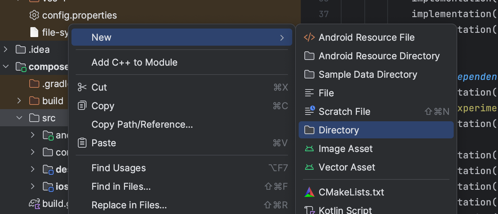
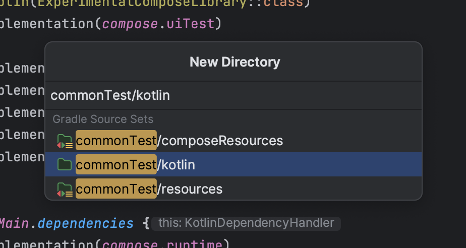

Puis vous pouvez écrire votre premier test :

```kotlin
class HelloTest {
    @OptIn(ExperimentalTestApi::class)
    @Test
    fun `Button should trigger click`() = runComposeUiTest {
        val clicked = mutableStateOf(false)

        setContent {
            HelloScreen {
                clicked.value = true
            }
        }

        onNodeWithTag("button").performClick()
        assertTrue { clicked.value }
    }
}
```

Pour que ce code fonctionne, vous devez modifier très légèrement votre composant `HelloScreen`, pour ajouter un tag à votre bouton. Ajouter `Modifier.testTag("button")` à votre bouton.

Dans mon cas, voici le résultat du bouton :

```kotlin
Button(modifier = Modifier.testTag("button"), onClick = onClick) {
    Text("Go back")
}
```

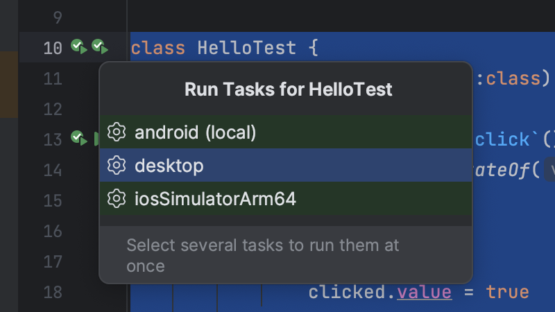

::: tip Remarque

Pour l'instant seulement les tests de type Desktop sont disponibles. Les tests de type Android sont en cours de développement.

:::

C'est à vous, je vous laisse écrire d'avantage de test pour votre application.

## L'intégration continue

Et pour terminer en beauté, voici un script Gitlab-CI pour lancer vos tests et générer vos APK :

```yaml
image: mingc/android-build-box:latest

# TEST
Test:
  stage: test
  script:
    - ./gradlew desktopTest
  artifacts:
    when: always
    paths:
      - composeApp/build/test-results/desktopTest/
    expire_in: 1 month
    reports:
      junit: composeApp/build/test-results/desktopTest/TEST-*.xml
  tags:
    - pmw
  rules:
    - if: $CI_COMMIT_BRANCH == $CI_DEFAULT_BRANCH

# BUILD
AndroidAppStaging:
  interruptible: true
  stage: build
  when: manual
  tags:
    - pmw
  script:
    - ./gradlew :composeApp:assembleDebug
  artifacts:
    paths:
      - composeApp/build/outputs/apk/**/**/*.apk
    expire_in: 1 week
  rules:
    - if: $CI_COMMIT_BRANCH == $CI_DEFAULT_BRANCH

# DEPLOY
LinuxPackageApplication:
  interruptible: true
  allow_failure: true
  stage: deploy
  when: manual
  tags:
    - pmw
  script:
    # - ./gradlew :composeApp:packageUberJarForCurrentOS
    - apt-get update -y
    - apt-get install -y fakeroot
    - ./gradlew :composeApp:packageDeb
  artifacts:
    paths:
      - ./composeApp/build/compose/binaries/main/deb/*.deb
    expire_in: 1 week
  rules:
    - if: $CI_COMMIT_BRANCH == $CI_DEFAULT_BRANCH

WindowsPackageApplication:
  interruptible: true
  stage: deploy
  when: manual
  tags:
    - windows
  script:
    - ./gradlew :composeApp:packageMsi
  artifacts:
    paths:
      - ./composeApp/build/compose/binaries/**/*.msi
    expire_in: 1 week
  rules:
    - if: $CI_COMMIT_BRANCH == $CI_DEFAULT_BRANCH

bundleAndroidRelease:
  interruptible: true
  stage: deploy
  tags:
    - pmw
  script:
    - ./gradlew :composeApp:signReleaseBundle
  artifacts:
    paths:
      - composeApp/build/outputs/bundle/release/*.aab
    expire_in: 1 week
  when: manual
  rules:
    - if: $CI_COMMIT_BRANCH == $CI_DEFAULT_BRANCH
```

## Conclusion

C'était un long tutoriel, mais je pense que nous avons vu l'essentiel pour créer une application Compose Multiplateform. Nous avons vu comment :

- Créer une application Compose Multiplateform.
- Gérer la navigation.
- Gérer les états.
- Gérer les appels réseau.
- Gérer les données sur le téléphone.
- Tester notre application.
- Générer nos APK.

Vous avez maintenant toutes les clés en main pour créer votre application Compose Multiplateform. Si vous avez des questions, n'hésitez pas ;).
