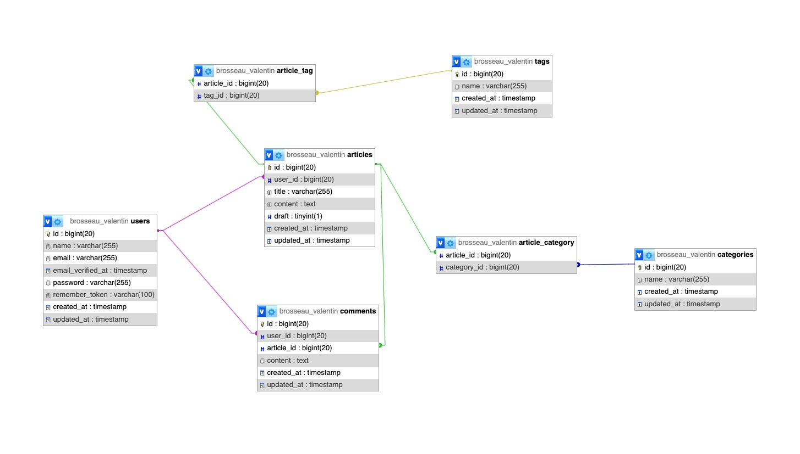
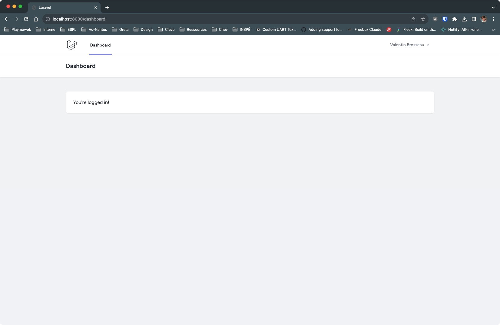
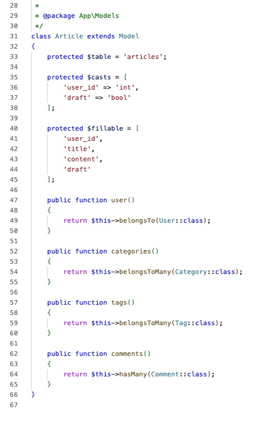
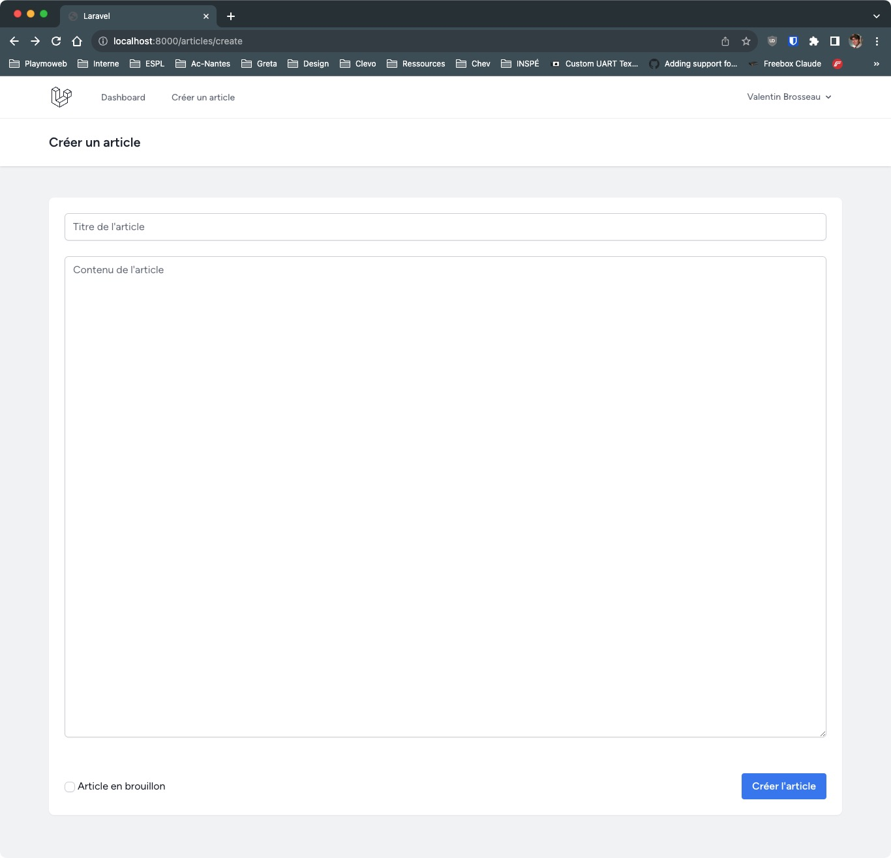
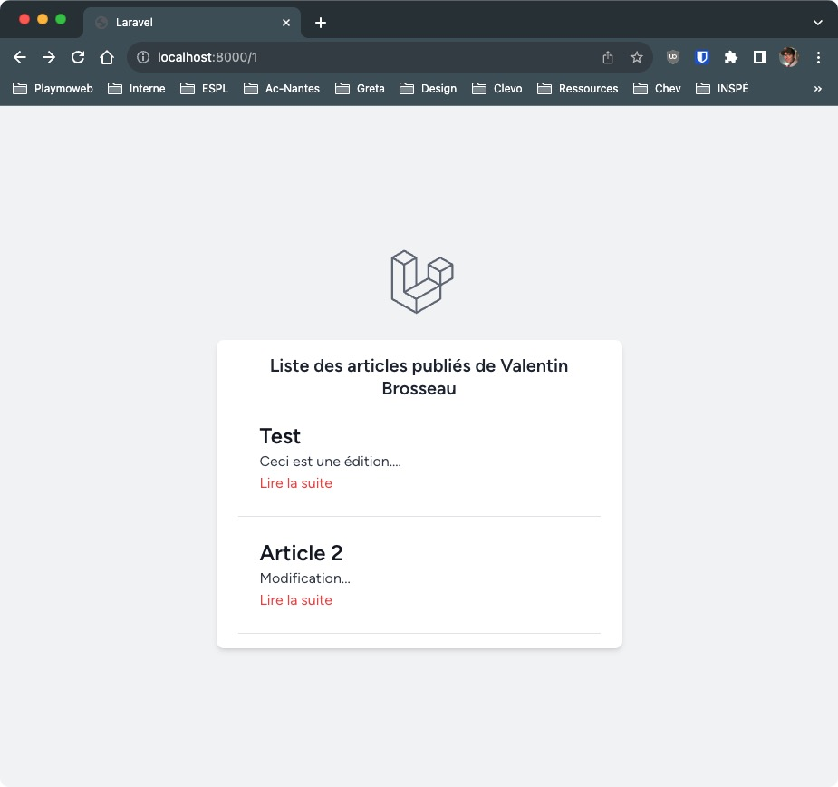
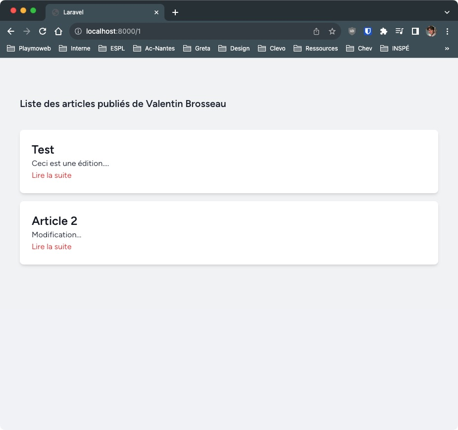
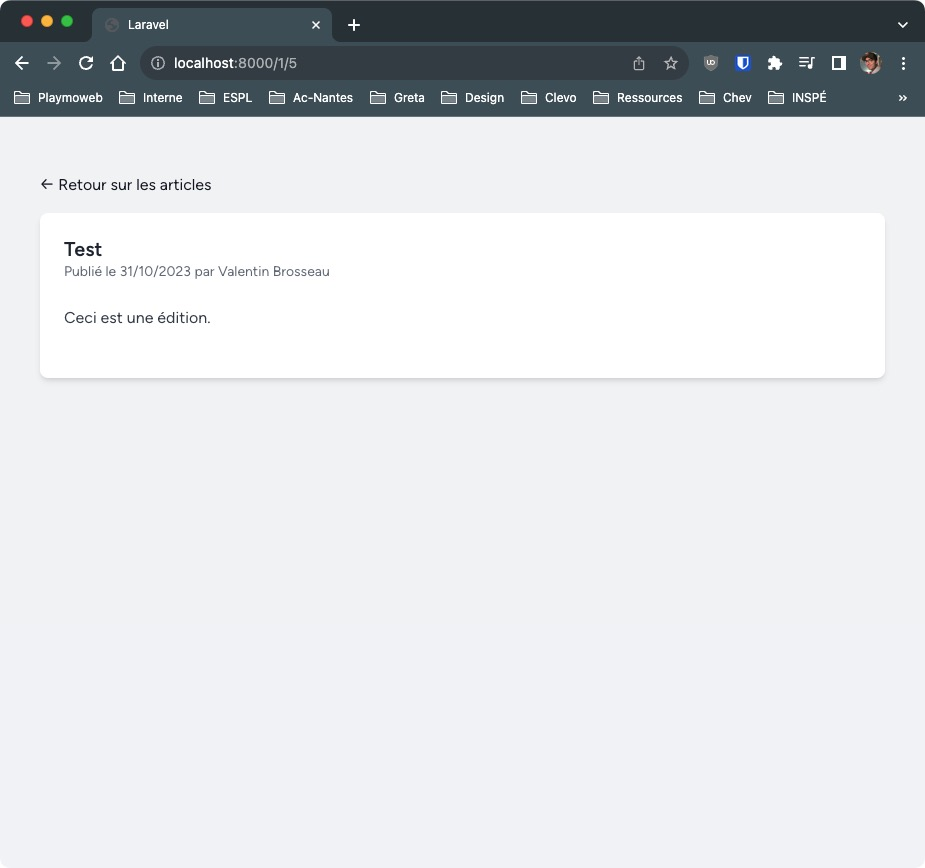
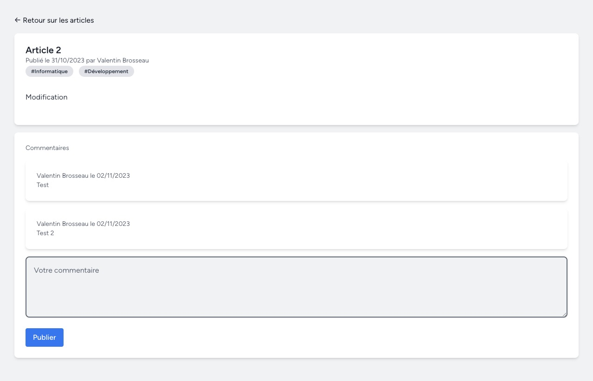
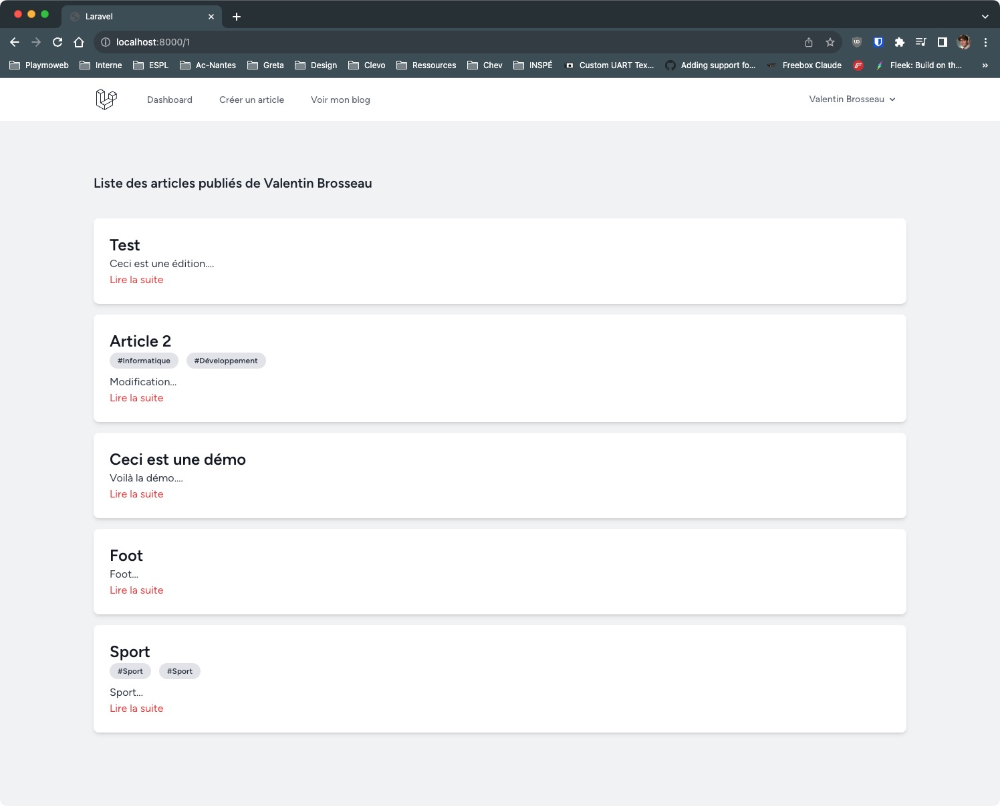

# Projet - Larablog

::: details Sommaire
[[toc]]
:::

## Introduction

Le projet consiste à créer une plateforme de blogging collaborative où les utilisateurs peuvent s'inscrire, se connecter et créer des articles. Chaque utilisateur peut écrire, éditer et supprimer ses propres articles. Les articles peuvent être associés à des catégories et des tags pour faciliter la recherche. Les utilisateurs peuvent également commenter les articles et interagir avec d'autres utilisateurs à travers les commentaires.

Voici un aperçu de la plateforme que vous allez réaliser:

<center>
<iframe width="100%" height="700px" src="https://www.youtube-nocookie.com/embed/fevKbHEFDzk?si=EdcDYdQh5SqKNkSO" title="YouTube video player" frameborder="0" allow="accelerometer; autoplay; clipboard-write; encrypted-media; gyroscope; picture-in-picture; web-share" allowfullscreen></iframe>
</center>

### Authentification des Utilisateurs:

- Inscription, connexion et déconnexion des utilisateurs.
- Réinitialisation de mot de passe par email.

### Gestion des Articles:

- Création, édition et suppression d'articles.
- Association d'articles à des catégories et des tags.
- Fonctionnalité de brouillon pour enregistrer les articles non publiés.

### Gestion des Commentaires:

- Ajout, édition et suppression de commentaires sur les articles.

### Interface Utilisateur Conviviale:

- Interface utilisateur intuitive pour la lecture des articles, l'écriture de commentaires et l'interaction avec d'autres utilisateurs.

### Sécurité:

- Validation des données côté serveur pour prévenir les attaques CSRF et XSS.
- Modération des commentaires pour prévenir le spam et le contenu inapproprié.

## Prérequis

Pour réaliser ce projet, nous allons utiliser Laravel 10. Pour réaliser le projet, vous aurez besoin des connaissainces en :

- PHP (HTML et CSS).
- Structure MVC.
- Requêtage SQL.

## Avant propos

Ce TP conclut l'apprentissage des bases de Laravel. Nous referrons d'autres TP pour entretenir ces bases. Mais ce que vous allez réaliser dans ce TP est un projet complet. Vous allez mettre en pratique toutes les connaissances que vous avez acquises jusqu'à présent.

Ce TP sera noté, vous pouvez vous entraider, mais vous devez réaliser le projet seul. Lors de mon évaluation, je tiendrai compte de :

- La qualité du code (respect des conventions, indentation, nommage des variables, etc.).
- L'utilisation du versionning (Git).
- Votre prise en compte des consignes.
- Votre prise d'initiative (ajout de fonctionnalités, amélioration de l'interface, etc.).

Je ne vais pas évaluer les points suivants :

- Le fait que votre projet « fonctionne ». Ça va de soi, ce que vous me rendez doit être fonctionnel.
- Le fait que votre projet soit « beau ». Je ne suis pas designer, je ne vais pas vous demander de faire un site web digne d'un professionnel. Je vais juste m'assurer que votre interface est lisible et que vous avez fait un effort pour la rendre agréable à utiliser.
- Le code fourni dans ce document. Ce code est juste un exemple, vous pouvez le suivre ou non. Je ne vais pas vous pénaliser si vous ne suivez pas ce code à la lettre. Je vais juste m'assurer que vous avez compris les concepts et que vous les avez appliqués correctement.

## Création du projet

Pour commencer, nous allons créer un nouveau projet Laravel. Pour cela, nous allons utiliser la commande :

```bash
composer create-project laravel/laravel larablog
```

::: tip Attention à l'emplacement du projet

Lorsque vous exécutez la commande `composer create-project`, le projet est créé dans un dossier portant le nom du projet. Dans notre cas, le dossier s'appelle `larablog`. 

Placez-vous dans un dossier vous appartenant avant de réaliser la commande

:::

::: warning N'oubliez pas la debugbar

N'oubliez pas d'installer la debugbar dans votre projet. Elle vous sera très utile pour débugger votre projet.

:::

## La base de données

Dans l'univers de Laravel, il est possible de réaliser la base de données de deux façons :

- En utilisant les migrations, donc complètement en code.
- En utilisant du SQL puis en générant les modèles relatifs à la base de données.

Dans ce TP, nous allons utiliser la deuxième méthode. Avant d'aller plus loin, nous allons créer la base de données de notre projet. Je vous la fournis :

```sql
-- Table des utilisateurs
CREATE TABLE `users` (
  `id` bigint(20) PRIMARY KEY AUTO_INCREMENT,
  `name` varchar(255) NOT NULL,
  `email` varchar(255) NOT NULL,
  `email_verified_at` timestamp NULL DEFAULT NULL,
  `password` varchar(255) NOT NULL,
  `remember_token` varchar(100) DEFAULT NULL,
  `created_at` timestamp NULL DEFAULT NULL DEFAULT CURRENT_TIMESTAMP,
  `updated_at` timestamp NULL DEFAULT NULL DEFAULT CURRENT_TIMESTAMP ON UPDATE CURRENT_TIMESTAMP
);

-- Table des catégories
CREATE TABLE categories (
    `id` bigint(20) PRIMARY KEY AUTO_INCREMENT,
    `name` VARCHAR(255) NOT NULL,
    `created_at` TIMESTAMP DEFAULT CURRENT_TIMESTAMP,
    `updated_at` TIMESTAMP DEFAULT CURRENT_TIMESTAMP ON UPDATE CURRENT_TIMESTAMP
);

-- Table des tags
CREATE TABLE tags (
    `id` bigint(20) PRIMARY KEY AUTO_INCREMENT,
    `name` VARCHAR(255) NOT NULL,
    `created_at` TIMESTAMP DEFAULT CURRENT_TIMESTAMP,
    `updated_at` TIMESTAMP DEFAULT CURRENT_TIMESTAMP ON UPDATE CURRENT_TIMESTAMP
);

-- Table des articles
CREATE TABLE articles (
    `id` bigint(20) PRIMARY KEY AUTO_INCREMENT,
    `user_id` bigint(20),
    `title` VARCHAR(255) NOT NULL,
    `content` TEXT NOT NULL,
    `draft` BOOLEAN DEFAULT 1,
    `created_at` TIMESTAMP DEFAULT CURRENT_TIMESTAMP,
    `updated_at` TIMESTAMP DEFAULT CURRENT_TIMESTAMP ON UPDATE CURRENT_TIMESTAMP,
    FOREIGN KEY (user_id) REFERENCES users(id)
);

-- Table pivot pour la relation many-to-many entre articles et catégories
CREATE TABLE article_category (
    `article_id` bigint(20),
    `category_id` bigint(20),
    FOREIGN KEY (article_id) REFERENCES articles(id),
    FOREIGN KEY (category_id) REFERENCES categories(id)
);

-- Table pivot pour la relation many-to-many entre articles et tags
CREATE TABLE article_tag (
    `article_id` bigint(20),
    `tag_id` bigint(20),
    FOREIGN KEY (article_id) REFERENCES articles(id),
    FOREIGN KEY (tag_id) REFERENCES tags(id)
);

-- Table des commentaires
CREATE TABLE comments (
    `id` bigint(20) PRIMARY KEY AUTO_INCREMENT,
    `user_id` bigint(20),
    `article_id` bigint(20),
    `content` TEXT NOT NULL,
    `created_at` TIMESTAMP DEFAULT CURRENT_TIMESTAMP,
    `updated_at` TIMESTAMP DEFAULT CURRENT_TIMESTAMP ON UPDATE CURRENT_TIMESTAMP,
    FOREIGN KEY (user_id) REFERENCES users(id),
    FOREIGN KEY (article_id) REFERENCES articles(id)
);
```

Avant de continuer étudiont un peu la base de données :



::: tip Remarque

Vous pouvez utiliser votre machine en local pour mettre la base de données, mais mieux encore ! Vous pouvez utiliser [bdd.dombtsig.local](http://bdd.dombtsig.local) pour créer votre base de données.

:::

## Configuration de votre projet

Avant de continuer, n'oubliez pas de configurer votre projet. Pour cela, vous devez modifier le fichier `.env` à la racine de votre projet.

Je vous laisse renseigner les paramètres de connexion à la base de données et le nom de l'application.

::: warning Remarque

Le fichier `.env` est un fichier qui ne sera pas versionné. Il est propre à votre environnement de développement. Vous pouvez donc le modifier sans risque.

Vous avez un fichier `.env.example` qui vous donne un exemple de configuration. Vous pouvez le dupliquer en `.env` pour commencer à travailler.

:::

## Authentification des utilisateurs

Pour l'authentification des utilisateurs nous n'allons pas réinventer la roue. Nous allons utiliser l'excellent package « Breeze » de Laravel. Pour l'installer, nous allons utiliser la commande :

```bash
composer require laravel/breeze --dev
```

Une fois le package installé, nous allons l'installer dans notre projet :

```bash
php artisan breeze:install
php artisan migrate
npm install
npm run build
```

::: tip Remarque

Pour l'installation de Breeze, nous allons choisir « Laravel with Alpine ».

:::

Voilà, nous avons maintenant un système d'authentification complet. Vous pouvez tester en vous inscrivant et en vous connectant. Vous pouvez également tester la réinitialisation de mot de passe.

Je vous laisse valider le bon fonctionnement avant de continuer.

::: tip Rappel

Pour lancer votre projet, vous devez utiliser la commande :

```bash
php artisan serve
```

:::

Si tout fonctionne, vous devriez avoir quelque chose comme ça :



## L'interface

Pour réaliser l'interface de notre projet, nous allons utiliser le framework CSS [TailwindCSS](https://tailwindcss.com/). Celui-ci sera **automatiquement** installé dans notre projet grace à l'ajout de Breeze.

Si vous souhaitez en savoir plus sur TailwindCSS, je vous invite à consulter la [documentation](https://tailwindcss.com/docs).

Sachez juste que TailwindCSS est un framework CSS qui permet de créer des interfaces rapidement. Il est très utilisé dans le monde du développement web. Il repose cependant sur l'utilisation de NPM, pour que votre CSS fonctionne correctement deux solutions :

- Executer periodiquement la commande `npm run build` pour compiler votre CSS.
- Observer les changements de votre CSS avec la commande `npm run dev`.

::: tip Comment moi je fais ?

Personnellement, j'utilise la commande `npm run dev` pour observer les changements de mon CSS. Je n'ai pas besoin de compiler mon CSS à chaque fois que je fais une modification.

:::

## Génération des modèles

Maintenant que nous avons notre base de données, nous allons générer les modèles correspondants. Pour cela, nous allons utiliser la commande :

```bash
composer require reliese/laravel --dev
```

Cette commande va installer le package `reliese/laravel` qui va nous permettre de générer les modèles. Une fois le package installé.

```php
php artisan vendor:publish --tag=reliese-models
php artisan config:clear
```

Puis nous allons générer les modèles en lien avec notre base de données :

```php
php artisan code:models --table=comments
php artisan code:models --table=articles
php artisan code:models --table=categories
php artisan code:models --table=tags
php artisan code:models --table=article_category
php artisan code:models --table=article_tag
```

Dans mon cas :


Je vous laisse maintenant observer les modèles générés. Vous pouvez voir que les relations entre les modèles ont été générées. C'est très pratique !


Dans le cas de la table `articles` vous pouvez observer :



Quelques remarques sur la classe `Article` :

- La classe `Article` hérite de la classe `Model` de Laravel.
- La classe `Article` possède une propriété `$table` qui indique le nom de la table associée au modèle. (Dans notre cas, la table `articles`). Vous observerez que la classe est au singulier et que la table est au pluriel. C'est une convention de Laravel.
- La classe `Article` possède une propriété `$fillable` qui indique les champs de la table qui peuvent être modifiés par l'utilisateur. (Dans notre cas, les champs `user_id`, `title`, `content` et `draft`).
- La classe `Article` possède une propriété `$casts` qui indique le type des champs de la table. (Dans notre cas, le champ `draft` est un booléen).

Quelques remarques sur les relations générées:

- Le modèle `Article` possède une relation `belongsTo` vers le modèle `User`. C'est la relation `user` qui a été générée. (Un article appartient à un utilisateur).
- Le modèle `Article` possède une relation `belongsToMany` vers le modèle `Category`. C'est la relation `categories` qui a été générée. (Un article peut avoir plusieurs catégories).
- Le modèle `Article` possède une relation `belongsToMany` vers le modèle `Tag`. C'est la relation `tags` qui a été générée. (Un article peut avoir plusieurs tags).
- Le modèle `Article` possède une relation `hasMany` vers le modèle `Comment`. C'est la relation `comments` qui a été générée. (Un article peut avoir plusieurs commentaires).

## Point étape

Nous avons maintenant la base de notre projet. Nous allons pouvoir commencer à coder. N'oubliez pas de faire un premier commit de votre projet.

Pssssttt! Bien entendu, vous pouvez faire des commits au fur et à mesure de votre avancement.

## Les fonctionnalités de base.

Avant d'entrer dans le coeur de la création de notre plateforme, nous allons découper en grandes étapes les fonctionnalités que nous allons réaliser.

- Espace utilisateur
  - [x] Inscription
  - [x] Connexion
  - [x] Déconnexion
  - [x] Réinitialisation de mot de passe
  - [ ] Création d'un article.
  - [ ] Liste des articles de l'utilisateur.
  - [ ] Édition d'un article.
  - [ ] Suppression d'un article.
- Partie publique
  - [ ] Liste des articles publiés d'un utilisateur.
  - [ ] Consultation d'un article si publié.
  - [ ] Liste des commentaires d'un article.
  - [ ] Ajout d'un commentaire sur un article.

Ces étapes sont la base de notre projet. Nous avons effectivement d'autres éléments à réaliser, mais nous allons commencer par ces étapes.

::: tip L'organisation

Dans un gros projet comme celui-ci, il est important de bien s'organiser. Découper le projet en étape est une bonne chose, ces différentes étapes seront vos objectifs. Vous pouvez les noter sur un papier ou dans un fichier texte. Vous pouvez également utiliser un outil de gestion de projet comme [Trello](https://trello.com/).

:::

## Espace utilisateur

Dans cette partie, nous allons réaliser les fonctionnalités liées à l'espace utilisateur.

Nous allons dans un premier temps réaliser notre contrôleur `UserController`. Pour cela, nous allons utiliser la commande :

```bash
php artisan make:controller UserController
```

Ce controller va nous permettre de gérer les fonctionnalités liées à l'espace utilisateur. Breeze nous a déjà généré toute la partie authentification, nous allons donc nous concentrer sur les fonctionnalités suivantes.

### Création d'un article

Pour commencer, nous allons réaliser la création d'un article. Pour cela, nous allons créer deux routes qui vont nous permettre d'afficher le formulaire de création d'un article.

```php
Route::get('/articles/create', [UserController::class, 'create'])->name('articles.create');
Route::post('/articles/store', [UserController::class, 'store'])->name('articles.store');
```

::: danger Attention

N'oubliez pas la sécurité ! Seul un utilisateur connecté doit pouvoir accéder à ces routes. À vous de placer la route au bon endroit dans le fichier `web.php`.

Avant de continuer, vous pouvez vérifier le bon ajout de vos routes en utilisant la commande :

```bash
php artisan route:list
```

:::

Puis nous allons créer la méthode `create` dans notre contrôleur `UserController`.

```php
public function create()
{
    return view('articles.create');
}
```

Nous allons maintenant créer la vue `articles.create` qui va nous permettre d'afficher le formulaire de création d'un article.

::: tip Rappel sur les vues

Dans Laravel, le `.` dans le nom de la vue correspond à un dossier. Dans notre cas, la vue `articles.create` correspond au fichier `resources/views/articles/create.blade.php`.

:::

Pour commencer, nous allons créer le fichier `resources/views/articles/create.blade.php`. Puis nous allons ajouter le code suivant :

```html
<x-app-layout>
    <x-slot name="header">
        <h2 class="font-semibold text-xl text-gray-800 dark:text-gray-200 leading-tight">
            Créer un article
        </h2>
    </x-slot>

    <form method="post" action="{{ route('articles.store') }}" class="py-12">
        @csrf
        <div class="max-w-7xl mx-auto sm:px-6 lg:px-8">
            <div class="bg-white dark:bg-gray-800 overflow-hidden shadow-sm sm:rounded-lg">
                <div class="p-6 text-gray-900 dark:text-gray-100">
                   <!-- Input de titre de l'article -->
                   <input type="text" name="title" id="title" placeholder="Titre de l'article" class="w-full rounded-md border-gray-300 shadow-sm focus:border-indigo-300 focus:ring focus:ring-indigo-200 focus:ring-opacity-50">
                </div>

                <div class="p-6 pt-0 text-gray-900 dark:text-gray-100">
                   <!-- Contenu de l'article -->
                   <textarea rows="30" name="content" id="content" placeholder="Contenu de l'article" class="w-full rounded-md border-gray-300 shadow-sm focus:border-indigo-300 focus:ring focus:ring-indigo-200 focus:ring-opacity-50"></textarea>
                </div>

                <div class="p-6 text-gray-900 dark:text-gray-100 flex items-center">
                    <!-- Action sur le formulaire -->
                    <div class="grow">
                        <input type="checkbox" name="draft" id="draft" class="rounded-md border-gray-300 shadow-sm focus:border-indigo-300 focus:ring focus:ring-indigo-200 focus:ring-opacity-50">
                        <label for="draft">Article en brouillon</label>
                    </div>
                    <div>
                        <button type="submit" class="bg-blue-500 hover:bg-blue-700 text-white font-bold py-2 px-4 rounded">
                            Créer l'article
                        </button>
                    </div>
                </div>
            </div>
        </div>
    </div>
</x-app-layout>
```

Un peu de détail sur le code :

- Nous utilisons le composant `x-app-layout` pour avoir le même design que les autres pages de notre application (header, footer, etc.).
- Le `x-slot` permet d'ajouter un titre à la page.
- Nous avons dans la page un formulaire qui va nous permettre de créer un article. L'action du formulaire est la route `articles.store` que nous avons créée précédemment.
- `@csrf` permet de générer un token CSRF pour sécuriser notre formulaire.
- Nous avons deux champs dans notre formulaire, un champ `title` et un champ `content`.
- Nous avons également un champ `draft` qui va nous permettre de savoir si l'article est un brouillon ou non.
- Nous avons un bouton `submit` qui va nous permettre d'envoyer le formulaire.

### Le menu

Pour l'instant nous ne pouvons pas accéder à la page de création d'un article. Nous allons donc ajouter un lien dans le menu de notre application. Pour cela, nous allons modifier le fichier `resources/views/layouts/navigation.blade.php`. Pour y ajouter l'élément suivant

```html
<x-nav-link :href="route('articles.create')" :active="request()->routeIs('article.create')">
    Créer un article
</x-nav-link>
```

Vous devez ajouter cet élément après le `dashboard` déjà présent dans le fichier.

### Tester

Je vous laisse tester votre code. Vous devriez avoir quelque chose comme ça :



### Enregistrer l'article

Maintenant que nous avons notre formulaire, nous allons pouvoir enregistrer notre article. Pour cela nous allons devoir faire le code derrère la route `articles.store` que nous avons créée précédemment.

Notre méthode a pour but de récupérer les données du formulaire et de les enregistrer dans la base de données. Pour cela, nous allons utiliser la méthode `store` du modèle `Article`.

```php
public function store(Request $request)
{
    // On récupère les données du formulaire
    $data = $request->only(['title', 'content', 'draft']);

    // Créateur de l'article (auteur)
    $data['user_id'] = Auth::user()->id;

    // Gestion du draft
    $data['draft'] = isset($data['draft']) ? 1 : 0;

    // On crée l'article
    $article = Article::create($data); // $Article est l'objet article nouvellement créé

    // Exemple pour ajouter la catégorie 1 à l'article
    // $article->categories()->sync(1);

    // Exemple pour ajouter des catégories à l'article
    // $article->categories()->sync([1, 2, 3]);

    // Exemple pour ajouter des catégories à l'article en venant du formulaire
    // $article->categories()->sync($request->input('categories'));

    // On redirige l'utilisateur vers la liste des articles
    return redirect()->route('dashboard');
}
```

Un peu de détail sur le code :

- Nous récupérons les données du formulaire avec la méthode `only` de la classe `Request`. Cette méthode nous permet de récupérer les données du formulaire en fonction de leur nom.
- Nous ajoutons l'id de l'utilisateur connecté dans les données du formulaire. Nous utilisons la classe `Auth` de Laravel pour récupérer l'utilisateur connecté.
- Nous utilisons la méthode `create` du modèle `Article` pour créer l'article dans la base de données.
- Nous redirigeons l'utilisateur vers la liste des articles.

Je vous laisse tester votre code. Si tout fonctionne, vous devriez avoir un article dans votre base de données.


### Liste des articles de l'utilisateur

Nous allons maintenant réaliser la liste des articles de l'utilisateur. Vous l'avez peut-être remarqué dans la méthode `store` de notre contrôleur `UserController`, nous redirigeons l'utilisateur vers `dashboard`. Nous allons donc modifier la vue `dashboard` pour afficher la liste des articles de l'utilisateur.

Notre route `dashboard` est la route par défaut de Breeze. Elle est définie dans le fichier `routes/web.php`. Nous allons la modifier pour qu'elle utilise la méthode `index` de notre contrôleur `UserController`.

```php
Route::get('/dashboard', [UserController::class, 'index'])->name('dashboard');
```

⚠️ Je vous laisse supprimer la route par défaut de Breeze.

Nous allons maintenant créer la méthode `index` dans notre contrôleur `UserController`.

```php
public function index()
{
    // On récupère l'utilisateur connecté.
    $user = Auth::user();

    // On retourne la vue.
    return view('dashboard', []);
}
```

Pour l'instant, nous n'avons pas encore récupéré les articles de l'utilisateur. Pour cela nous allons utiliser un `where` sur le modèle `Article`.

```php
$articles = Article::where('user_id', $user->id)->get();
```

Nous allons maintenant passer les articles à la vue.

```php
return view('dashboard', [
    'articles' => $articles
]);
```

Nous allons maintenant modifier la vue `dashboard` pour afficher les articles de l'utilisateur. Éditer le fichier `resources/views/dashboard.blade.php` et ajouter le code suivant :

```html
<!-- Articles -->
@foreach ($articles as $article)
    <div class="bg-white dark:bg-gray-800 overflow-hidden shadow-sm sm:rounded-lg mt-4">
        <div class="p-6 text-gray-900 dark:text-gray-100">
            <h2 class="text-2xl font-bold">{{ $article->title }}</h2>
            <p class="text-gray-700 dark:text-gray-300">{{ substr($article->content, 0, 30) }}...</p>
        </div>
    </div>
@endforeach
```

Un peu de détail sur le code :

- Nous utilisons une boucle `foreach` pour parcourir les articles.
- Nous affichons le titre de l'article avec la variable `$article->title`.
- Nous affichons le contenu de l'article avec la variable `$article->content`. Nous utilisons la fonction `substr` pour ne récupérer que les 30 premiers caractères.

Je vous laisse tester votre code. Vous devriez avoir quelque chose comme ça :


Je vous laisse également valider que vous pouvez créer plusieurs articles et que la liste s'adapte.

::: tip tester régulièrement et dans plusieurs situations

Il est important de tester régulièrement votre code. Vous devez tester dans plusieurs situations. Vous devez tester avec un article, avec deux articles, avec un article en brouillon, etc.

Vous pouvez également tester avec plusieurs utilisateurs. Vous pouvez créer un utilisateur avec un compte différent pour tester.

:::

### Édition d'un article

Nous allons maintenant réaliser l'édition d'un article. Pour cela, nous allons créer deux routes qui vont nous permettre d'afficher le formulaire d'édition d'un article.

```php
Route::get('/articles/{article}/edit', [UserController::class, 'edit'])->name('articles.edit');
Route::post('/articles/{article}/update', [UserController::class, 'update'])->name('articles.update');
```

::: danger Attention

N'oubliez pas la sécurité ! Seul un utilisateur connecté doit pouvoir accéder à ces route. À vous de placer la route au bon endroit dans le fichier `web.php`.

:::

Pour la suite, je ne vais pas vous guider pas à pas. Je vais vous laisser réaliser le code par vous-même. Je vous laisse donc réaliser les étapes suivantes :

- Créer la méthode `edit` dans le contrôleur `UserController`.
- Créer la vue `articles.edit` qui va nous permettre d'afficher le formulaire d'édition d'un article.
- Créer la méthode `update` dans le contrôleur `UserController`.
- Modifier la vue `dashboard` pour ajouter un lien d'édition sur chaque article.

Voici le code nécessaire pour réaliser les différentes étapes

Des méthodes :

```php
public function edit(Article $article)
{
    // On vérifie que l'utilisateur est bien le créateur de l'article
    if ($article->user_id !== Auth::user()->id) {
        abort(403);
    }

    // On retourne la vue avec l'article
    return view('articles.edit', [
        'article' => $article
    ]);
}

public function update(Request $request, Article $article)
{
    // On vérifie que l'utilisateur est bien le créateur de l'article
    if ($article->user_id !== Auth::user()->id) {
        abort(403);
    }

    // On récupère les données du formulaire
    $data = $request->only(['title', 'content', 'draft']);

    // Gestion du draft
    $data['draft'] = isset($data['draft']) ? 1 : 0;

    // On met à jour l'article
    $article->update($data);

    // On redirige l'utilisateur vers la liste des articles (avec un flash)
    return redirect()->route('dashboard')->with('success', 'Article mis à jour !');
}
```

Une page :

```html
<x-app-layout>
    <x-slot name="header">
        <h2 class="font-semibold text-xl text-gray-800 dark:text-gray-200 leading-tight">
            Modifier l'article {{ $article->id }}
        </h2>
    </x-slot>

    <form method="post" action="{{ route('articles.update', $article->id) }}" class="py-12">
        @csrf
        <div class="max-w-7xl mx-auto sm:px-6 lg:px-8">
            <div class="bg-white dark:bg-gray-800 overflow-hidden shadow-sm sm:rounded-lg">
                <div class="p-6 text-gray-900 dark:text-gray-100">
                   <!-- Input de titret de l'article -->
                   <input type="text" value="{{ $article->title }}" name="title" id="title" placeholder="Titre de l'article" class="w-full rounded-md border-gray-300 shadow-sm focus:border-indigo-300 focus:ring focus:ring-indigo-200 focus:ring-opacity-50">
                </div>

                <div class="p-6 pt-0 text-gray-900 dark:text-gray-100">
                   <!-- Contenu de l'article -->
                   <textarea rows="30" name="content" id="content" placeholder="Contenu de l'article" class="w-full rounded-md border-gray-300 shadow-sm focus:border-indigo-300 focus:ring focus:ring-indigo-200 focus:ring-opacity-50">{{ $article->content }}</textarea>
                </div>

                <div class="p-6 text-gray-900 dark:text-gray-100 flex items-center">
                    <!-- Action sur le formulaire -->
                    <div class="grow">
                        <input type="checkbox" name="draft" id="draft" {{ $article->draft ? 'checked' : '' }} class="rounded-md border-gray-300 shadow-sm focus:border-indigo-300 focus:ring focus:ring-indigo-200 focus:ring-opacity-50">
                        <label for="draft">Article en brouillon</label>
                    </div>
                    <div>
                        <button type="submit" class="bg-blue-500 hover:bg-blue-700 text-white font-bold py-2 px-4 rounded">
                            Modifier l'article
                        </button>
                    </div>
                </div>
            </div>
        </div>
    </div>
</x-app-layout>
```

Lien permettant l'édition :

```html
<div class="text-right">
    <a href="{{ route('articles.edit', $article->id) }}" class="text-red-500 hover:text-red-700">Modifier</a>
</div>
```

div pour le message flash (message qui s'affiche une seule fois) :

```html
<!-- Message flash -->
@if (session('success'))
<div class="bg-green-500 text-white p-4 rounded-lg mt-6 mb-6 text-center">
    {{ session('success') }}
</div>
@endif
```

Avant que vous ne placiez le code dans votre projet. Observons le code ensemble.

- Nous utilisons la classe `Article` dans les méthodes `edit` et `update` de notre contrôleur `UserController`. Nous utilisons le type `Article` dans les paramètres des méthodes. Laravel va automatiquement récupérer l'article en fonction de l'id passé dans l'URL.
- Nous utilisons la méthode `update` du modèle `Article` pour mettre à jour l'article dans la base de données.
- Nous utilisons la méthode `with` de la classe `RedirectResponse` pour ajouter un message flash à la redirection. Nous utilisons la méthode `session` pour récupérer la session de l'utilisateur. Nous utilisons la méthode `success` pour ajouter un message flash de type `success`. Le `flash` est un message qui ne s'affiche qu'une seule fois. Il est très pratique pour afficher des messages de succès ou d'erreur après une action.
- Nous utilisons la méthode `route` pour générer une URL. Nous utilisons la méthode `articles.edit` pour générer l'URL de la route `articles.edit`. Nous passons l'id de l'article en paramètre de la méthode `route`.
- Nous avons fait attention à bien sécuriser les routes. Nous avons vérifié que l'utilisateur connecté est bien le créateur de l'article. Si ce n'est pas le cas, nous retournons une erreur 403. (Accès interdit).

C'est à vous de jouer ! Je vous laisse implémenter le code dans votre projet. Une fois réalisé, vous devriez avoir quelque chose comme ça :

<center>
<iframe width="560" height="315" src="https://www.youtube-nocookie.com/embed/xE8Jbmo5WHU?si=QqVu41wHF3t14n5o" title="YouTube video player" frameborder="0" allow="accelerometer; autoplay; clipboard-write; encrypted-media; gyroscope; picture-in-picture; web-share" allowfullscreen></iframe>
</center>

### Amélioration de l'interface

Nous l'avons vu lors de l'édition d'un article, il est possible d'ajouter un message flash. Je vous laisse faire la même chose pour la création d'un article.


### Amélioration de l'interface 2

Dans le même esprit que l'amélioration précédente, nous allons ajouter un message flash lorsqu’un utilisateur tente d'accéder à un article qui ne lui appartient pas.

Le message flash doit être de type `error` et doit contenir le message suivant : « Vous n'avez pas le droit d'accéder à cet article », il doit s'afficher sur un fond rouge.


::: details un peu d'aide ?

```html
@if (session('error'))
    <div class="bg-red-500 text-white p-4 rounded-lg mt-6 mb-6 text-center">
        {{ session('error') }}
    </div>
@endif
```

:::

### Suppression d'un article

Je vous laisse réaliser la partie suppression d'unt article. Voici les étapes à réaliser :

- Créer la route `articles.remove` qui va nous permettre de supprimer un article.
- Créer la méthode `remove` dans le contrôleur `UserController`.
- Écrire le code de la méthode `remove` pour supprimer l'article.
- Après la suppression de l'article, rediriger l'utilisateur vers la liste des articles avec un message flash.
- Ajouter un lien de suppression sur chaque article dans la vue `dashboard`.

::: tip Rappel

Pour supprimer un article, vous pouvez utiliser la méthode `delete` du modèle `Article`.

```php
$article = Article::find($id);
$article->delete();
```

⚠️ N'oubliez pas de vérifier que l'utilisateur connecté est bien le créateur de l'article. Vous pouvez utiliser la même méthode que pour l'édition d'un article.

:::

## Point étape

Vous avez la base de la partie utilisateur. Vous pouvez maintenant créer des articles, les modifier ainsi que les supprimer. Je vous propose de faire un nouveau commit de votre projet.

## Partie publique

Nous allons maintenant nous attaquer à la partie publique de notre site Internet. Pour rappel, cette partie va nous permettre de consulter les articles publiés pour chaque utilisateur.

### Le contrôleur public

Pour commencer, nous allons créer un contrôleur `PublicController` qui va nous permettre de gérer la partie publique de notre site Internet.

```bash
php artisan make:controller PublicController
```

### Liste des articles publiés d'un utilisateur

Nous allons maintenant créer une route qui va nous permettre d'afficher la liste des articles publiés d'un utilisateur.

```php
Route::get('/{user}', [PublicController::class, 'index'])->name('public.index');
Route::get('/{user}/{article}', [PublicController::class, 'show'])->name('public.show');
```

::: tip Cette route

Cette route doit être la dernière route de votre fichier `web.php`. En effet, elle doit être la dernière route de votre fichier pour ne pas interférer avec les autres routes.

Elle doit permettre d'afficher la liste des articles publiés d'un utilisateur.

:::

Nous allons maintenant créer la méthode `index` dans notre contrôleur `PublicController`.

```php
public function index(User $user)
{
    // On récupère les articles publiés de l'utilisateur
    $articles = Article::where('user_id', $user->id)->where('draft', 0)->get();

    // On retourne la vue
    return view('public.index', [
        'articles' => $articles,
        'user' => $user
    ]);
}
```

Un peu de détail sur le code :

- Nous utilisons la classe `User` dans les paramètres de la méthode `index`. Laravel va automatiquement récupérer l'utilisateur en fonction de l'id passé dans l'URL.
- Nous utilisons la méthode `where` du modèle `Article` pour récupérer les articles publiés de l'utilisateur.
- Nous passons les articles et l'utilisateur à la vue.

Nous allons maintenant créer la vue `public.index` qui va nous permettre d'afficher la liste des articles publiés d'un utilisateur. Créer le fichier `resources/views/public/index.blade.php` et ajouter le code suivant :

```html
<x-guest-layout>
    <div class="text-center">
        <h2 class="font-semibold text-xl text-gray-800 dark:text-gray-200 leading-tight">
            Liste des articles publiés de {{ $user->name }}
        </h2>
    </div>

    <div>
        <!-- Articles -->
        @foreach ($articles as $article)
        <div>
            <div class="p-6 text-gray-900 dark:text-gray-100">
                <h2 class="text-2xl font-bold">{{ $article->title }}</h2>
                <p class="text-gray-700 dark:text-gray-300">{{ substr($article->content, 0, 30) }}...</p>
                
                <a href="{{ route('public.show', [$article->user_id, $article->id]) }}" class="text-red-500 hover:text-red-700">Lire la suite</a>
            </div>
        </div>
        <hr>
        @endforeach
    </div>
</x-guest-layout>
```

Un peu de détail sur le code :

- Nous utilisons le composant `x-guest-layout` pour avoir une page vide.
- Nous utilisons la classe `User` dans la vue pour récupérer le nom de l'utilisateur.
- Nous utilisons la classe `Article` dans la vue pour récupérer le titre et le contenu de l'article.
- Nous affichons une liste d'articles. Celle-ci est construite avec une boucle `foreach`.

Je vous laisse tester votre code. Vous devriez avoir quelque chose comme ça :



### Consultation d'un article publié

Dans votre routeur vous avez déjà créé la route `public.show` qui va nous permettre d'afficher un article. Nous allons maintenant créer la méthode `show` dans notre contrôleur `PublicController`.

```php
public function show(User $user, Article $article)
{
    // $user est l'utilisateur de l'article
    // $article est l'article à afficher

    // Je vous laisse faire le code
    // N'oubliez pas de vérifier que l'article est publié (draft == 0)
}
```

```html
<x-guest-layout>
    <div class="text-center">
        <h2 class="font-semibold text-xl text-gray-800 dark:text-gray-200 leading-tight">
            {{ $article->title }}
        </h2>
    </div>

    <div class="text-gray-500 text-sm">
        Publié le {{ $article->created_at->format('d/m/Y') }} par <a href="{{ route('public.index', $article->user->id) }}">{{ $article->user->name }}</a>
    </div>

    <div>
        <div class="p-6 text-gray-900 dark:text-gray-100">
            <p class="text-gray-700 dark:text-gray-300">{{ $article->content }}</p>
        </div>
    </div>
</x-guest-layout>
```

Un peu de détail sur le code :

- Nous utilisons la classe `User` dans les paramètres de la méthode `show`. Laravel va automatiquement récupérer l'utilisateur en fonction de l'id passé dans l'URL.
- Nous utilisons la classe `Article` dans les paramètres de la méthode `show`. Laravel va automatiquement récupérer l'article en fonction de l'id passé dans l'URL.

Je vous laisse écrire le code de la méthode `show` et de la vue `public.show`. Une fois réalisé, vous devriez avoir quelque chose comme ça :

<center>
<iframe width="560" height="315" src="https://www.youtube-nocookie.com/embed/gErtL4ZQA7M?si=KdS2Youfj5uqxYnR" title="YouTube video player" frameborder="0" allow="accelerometer; autoplay; clipboard-write; encrypted-media; gyroscope; picture-in-picture; web-share" allowfullscreen></iframe>
</center>

### Amélioration de l'interface

Modifier le composant `x-guest-layout` pour que celui ne soit plus centré. Profitez-en également pour le modifier afin d'avoir un header et un footer.

Le composant se trouve dans le fichier `resources/views/layouts/guest.blade.php`.

Vous pouvez également retirer le logo de la page (ou mettre le votre).

Pour vous inspirer, vous pouvez aller voir le template [Tailwind Awesome](https://www.tailwindawesome.com/?price=free&type=template) qui propose des templates gratuits.

::: tip Rappel

N'oubliez pas d'inclure le `{{ $slot }}` dans votre template. Sinon, vous n'aurez pas le contenu de vos pages.

**Rappel**, le `{{ $slot }}` correspond au contenu de votre composant.

:::

Dans mon cas, j'ai ajusté quelques éléments pour avoir quelque chose comme ça :




## Point étape

Vous avez maintenant la base de la partie publique de votre site Internet. Vous pouvez maintenant consulter les articles publiés de chaque utilisateur.

Je vous laisse faire un nouveau commit de votre projet.

## Les commentaires

Les commentaires sont une fonctionnalité importante d'un blog. Nous allons donc les ajouter à notre projet. 

Chaque article doit avoir une liste de commentaires. Chaque utilisateur doit pouvoir ajouter un commentaire sur un article. L'ajout de commentaire ne doit être possible que pour les utilisateurs connectés.

### Comment allons nous procéder ?

Pour traiter cette ajout de fonctionnalité, nous allons procéder de la manière suivante :

- Création d'un contrôleur `CommentController` qui va nous permettre de gérer les commentaires.
- Création d'une route `comments.store` qui va nous permettre d'ajouter un commentaire.
- Modification de la vue `public.show` pour ajouter :
  - Une liste des commentaires.
  - Un formulaire pour ajouter un commentaire. (Si l'utilisateur est connecté).
- Nous avons à notre disposition un modèle `Comment` qui va nous permettre de stocker les commentaires.
- Nous avons une relation entre les modèles `Article` et `Comment` qui va nous permettre de récupérer les commentaires d'un article.

### Création du contrôleur

Nous l'avons vu précédemment, nous allons créer un contrôleur `CommentController` qui va nous permettre de gérer les commentaires.

Je vous laisse retrouver la commande pour créer un contrôleur (vous l'avez déjà utilisée plusieurs fois, celle-ci est également disponible dans l'aide mémoire).

### Ajout de la route

Maintenant que nous avons notre contrôleur, nous allons créer la route `comments.store` qui va nous permettre d'ajouter un commentaire.

::: details un peu d'aide ?

Vous ne devriez pas avoir de difficulté à créer la route. Vous pouvez vous inspirer des routes déjà présentes dans le fichier `routes/web.php`. Mais voici un petit rappel.

```php
Route::post('/comments/store', [CommentController::class, 'store'])->name('comments.store');
```

:::

### Ajouter la méthode store

Pour rappel, la méthode `store` va nous permettre d'ajouter un commentaire en base de données. Je vous laisse écrire la méthode `store` dans le contrôleur `CommentController`. Voici les étapes à réaliser :

- Récupérer les données du formulaire (commentaire, articleId).
- Créer le commentaire dans la base de données.
- Rediriger l'utilisateur vers la page de l'article qu'il vient de commenter.

C'est à vous de jouer ! Je vous laisse implémenter le code dans votre projet.

::: tip Rappel

Pour créer un commentaire dans la base de données, vous pouvez utiliser la méthode `create` du modèle `Comment`.

```php
Comment::create([
    'content' => $content,
    'article_id' => $articleId,
    'user_id' => Auth::user()->id
]);
```

:::

::: danger Attention

N'oubliez pas de vérifier que la personne est connectée avant d'ajouter un commentaire. Vous pouvez utiliser la classe `Auth` de Laravel pour vérifier si un utilisateur est connecté.

```php
if (Auth::check()) {
    // L'utilisateur est connecté
}
```

Si l'utilisateur n'est pas connecté, vous devez rediriger l'utilisateur vers la page de connexion (```return redirect()->route('login');```).

:::

::: tip L'astuce du chef

En Laravel, il exist une methode redirect qui permet de rediriger l'utilisateur vers la page précédente.

```php
return redirect()->back();
```

:::

### Ajouter le formulaire

Nous allons maintenant ajouter le formulaire qui va nous permettre d'ajouter un commentaire. Pour cela, nous allons modifier la vue `public.show`. Je ne vais pas vous donner le code en entier du formulaire, je vais vous donner les grandes lignes.

```html
<!-- Ajout d'un commentaire -->
<form action="{{ route('comments.store') }}" method="post" class="mt-6">
    @csrf
    <input type="hidden" name="articleId" value="{{ $article->id }}">

    <!-- Ajouter le reste de votre formulaire -->
</form>
```

Un peu de détail sur le code :

- Nous utilisons la méthode `route` pour générer une URL. Nous utilisons la méthode `comments.store` pour générer l'URL de la route `comments.store`.
- Nous utilisons la méthode `csrf` pour générer un token CSRF pour sécuriser notre formulaire.
- Nous utilisons un champ `hidden` pour stocker l'id de l'article (pour lequel nous ajoutons un commentaire).

::: danger Attention

N'oubliez pas qu'il ne dois être possible d'ajouter un commentaire que pour les utilisateurs connectés. Vous devez donc ajouter une condition pour afficher le formulaire uniquement si l'utilisateur est connecté. En Laravel vous pouvez utiliser la classe `Auth` pour vérifier si un utilisateur est connecté.

```php
@auth
    <!-- Le code affiché si la personne est connecté -->
@endauth
```

:::

### Ajouter la liste des commentaires

Maintenant que nous avons la possiblitité d'ajouter un commentaire, nous allons ajouter la liste des commentaires. Pour cela, nous allons modifier la vue `public.show`. Je ne vais pas vous donner le code en entier de la liste des commentaires, je vais vous donner les grandes lignes.

```html
<!-- Liste des commentaires -->
@foreach ($article->comments as $comment)
    <!-- $comment représente un commentaire -->
@endforeach
```

### Le résultat

Vous avez maintenant la possibilité d'ajouter des commentaires sur vos articles. Dans mon cas, voici le résultat :


## Point étape

Vous avez maintenant la base de votre site Internet. Vous pouvez maintenant créer des articles, les modifier, les supprimer et les consulter. Vous pouvez également consulter les articles publiés de chaque utilisateur.

Je vous laisse faire un nouveau commit de votre projet.

## Les catégories

Chaque article peut avoir une ou plusieurs catégories (technologie, sport, etc.). Actuellement, nous n'avons pas de catégorie. Je vous propose donc d'ajouter cette fonctionnalité à notre site Internet.

La liste des catégories sera fixe, c'est à dire que nous allons les mettres en dur dans notre base de données. Nous n'allons pas créer une interface pour les gérer.

Vu que nous avons généré nos modèles à partir de la base de données, nos relations en code sont déjà présentes. Nous allons avoir uniquement les modifications de code et d'interface à faire.

### Remplissage de la base de données

Pour commencer, nous allons remplir notre base de données avec les catégories. Pour cela, je vous laisse insérer les catégories suivantes dans la table `categories` :

- Technologie
- Sport
- Jeux vidéo
- Cinéma
- Musique
- IA
- Développement
- Informatique

### Comment allons nous procéder ?

Pour traiter cette ajout de fonctionnalité, nous allons procéder de la manière suivante :

Partie public :

- Modifier la page d'affichage de la liste des articles pour afficher les catégories.
- Modifier la page d'affichage d'un article pour afficher les catégories.

::: tip Comment tester ?

Avant de faire la partie Utilisateur, vous pourrez tester votre code en insérant manuellement des catégories dans la base de données pour les articles que vous avez déjà créés.

:::

Partie utilisateur :

- Modifier la page de création d'un article pour permettre de choisir une ou des catégories.
- Modifier le code qui sauvegarde l'article pour sauvegarder les catégories.
- Modifier la page d'édition d'un article pour permettre de choisir une ou des catégories.
- Modifier le code qui sauvegarde l'article pour sauvegarder les catégories.

::: tip C'est à vous de jouer !

Ici je ne vais pas vous guider pas à pas. Je vais vous laisser réaliser le code par vous-même. L'important dans une fonctionnalité comme celle-ci, c'est de se projeter dans le résultat final.

Je vous donne juste une petite aide : 

Si vous souhaitez avoir la liste des catégories depuis un article, vous pouvez utiliser la propriété `categories` de l'article.

```php
@foreach ($article->categories as $category)
    {{ $category->name }}
@endforeach
```

Si vous souhaitez avoir l'ensemble des catégories, vous pouvez utiliser la méthode `all` du modèle `Category`.

```php
$categories = Category::all();
```

Si vous souhaitez sauvegarder les catégories d'un article, vous pouvez utiliser la méthode `sync` du modèle `Article`.

```php
    // $article est l'article sauvé en base de données (resultat de la méthode create ou d'un update)
    // Exemple pour ajouter des catégories à l'article en venant du formulaire
    $article->categories()->sync($request->input('categories'));
```

:::

### Le résultat




## Amélioration de l'interface

Nous avons un projet complètement fonctionnel. Je vous propose d'ajouter quelques éléments pour simplifier la navigation :

Ajout d'un lien « voir mon blog » dans le menu de l'utilisateur. Ce lien doit rediriger vers la liste des articles publiés de l'utilisateur connecté.


::: details un peu d'aide ?

```html
<x-nav-link :href="route('public.index', Auth::id())" :active="request()->routeIs('article.index')">
    Voir mon blog
</x-nav-link>
```

## Amélioration de l'interface 2

Pour l'instant il est probable que votre page « publique » ne possède pas de menu de navigation. Je vous propose de l'ajouter dans le fichier `guest.blade.php`:

```html
@auth
    @include('layouts.navigation')
@endauth

@guest
    @if (Route::has('login'))
        <livewire:welcome.navigation />
    @endif
@endguest
```

Voilà le résultat chez moi :



## Point étape

Votre projet avance bien !

Je vous laisse faire un nouveau commit de votre projet.

## Les likes

Vous arrivez à la fin de votre projet. Il ne vous reste plus qu'une fonctionnalité à réaliser. Les likes.

Sur chaque article, vous devez ajouter un bouton qui va permettre de liker l'article. Lorsque l'utilisateur clique sur le bouton, vous devez ajouter un like à l'article. Ce compteur doit être à l'infini. C'est à dire que l'utilisateur peut liker plusieurs fois le même article.

Vous devez également afficher le nombre de like sur chaque article.

::: tip Rappel

Pour réaliser cette fonctionnalité, vous devrez ajouter une nouvelle colonne dans la table `articles`. Cette colonne de type integer va nous permettre de stocker le nombre de like de l'article.

Une fois la colonne ajoutée, vous devrez modifier le modèle `Article` pour ajouter la colonne dans la propriété `$fillable` et `$casts`.

:::

Pour vous aider dans votre réalisation, voici les étapes à réaliser :

- Ajouter une colonne `likes` dans la table `articles`.
- Modifier le modèle `Article` pour ajouter la colonne dans la propriété `$fillable` et `$casts`.
- Modifier la vue `public.show` pour ajouter un bouton « like » et le nombre de like.
- Ajouter une route `articles.like` qui va nous permettre de liker un article.
- Ajouter la méthode `like` dans le contrôleur `ArticleController`.

Voici un peu de HTML pour vous aider :

```html
@auth
<a href="{{ route('article.like', $article->id) }}" class="block bg-blue-500 hover:bg-blue-700 text-white font-bold py-2 px-4 rounded text-center">
    <svg xmlns="http://www.w3.org/2000/svg" class="h-6 w-6 text-white" viewBox="0 0 20 20" fill="currentColor">
        <path fill-rule="evenodd" d="M9.719,17.073l-6.562-6.51c-0.27-0.268-0.504-0.567-0.696-0.888C1.385,7.89,1.67,5.613,3.155,4.14c0.864-0.856,2.012-1.329,3.233-1.329c1.924,0,3.115,1.12,3.612,1.752c0.499-0.634,1.689-1.752,3.612-1.752c1.221,0,2.369,0.472,3.233,1.329c1.484,1.473,1.771,3.75,0.693,5.537c-0.19,0.32-0.425,0.618-0.695,0.887l-6.562,6.51C10.125,17.229,9.875,17.229,9.719,17.073 M6.388,3.61C5.379,3.61,4.431,4,3.717,4.707C2.495,5.92,2.259,7.794,3.145,9.265c0.158,0.265,0.351,0.51,0.574,0.731L10,16.228l6.281-6.232c0.224-0.221,0.416-0.466,0.573-0.729c0.887-1.472,0.651-3.346-0.571-4.56C15.57,4,14.621,3.61,13.612,3.61c-1.43,0-2.639,0.786-3.268,1.863c-0.154,0.264-0.536,0.264-0.69,0C9.029,4.397,7.82,3.61,6.388,3.61" clip-rule="evenodd" />
    </svg>
    <span>{{$article->like}}</span>
</a>
@endauth
```

- Nous avons un lien qui pointe vers la route `articles.like`.
- Nous avons un bouton avec un SVG pour afficher un coeur.
- Nous avons un span qui affiche le nombre de like.

Voici le rendu :


## La page d'accueil

Maintenant que vous avez toutes les fonctionnalités de votre site Internet, vous allez pouvoir créer une page d'accueil. Cette page va afficher les articles le plus liké de la plateforme.

::: tip Rappel

Pour réaliser cette fonctionnalité, vous allez devoir modifier :

- Le contrôleur `PublicController` pour ajouter la méthode `home`.
- Le fichier `routes/web.php` pour ajouter la route `/`. (Vous allez devoir remplacer déjà présente par la votre).

:::

## Bonus

Vous avez terminé votre projet ? Vous avez encore du temps ? Voici quelques idées de fonctionnalités supplémentaires.

- Permettre l'ajout de tags sur les articles.
- Ajouter un système de pagination sur la liste des articles.
- Ajouter un système de recherche sur la liste des articles.
- Voir les articles en fonction d'une catégorie.
- Voir les articles en fonction d'un tag.

## Déploiement

Maintenant que votre projet est terminé, vous allez pouvoir le déployer sur un serveur. Pour cela, je vous invite à suivre le TP suivant :

[TP - Déploiement d'un projet Laravel](https://cours.brosseau.ovh/tp/ops/deployer-laravel.html)

::: tip Rappel

N'oubliez pas de faire un commit de votre projet avant de le déployer. Pour finaliser votre projet vous devez le déployer sur un serveur. Vous devez me partager l'URL de votre projet déployé.

:::

## Conclusion

Vous avez terminé votre projet. Vous avez maintenant un blog fonctionnel. Vous pouvez maintenant le personnaliser à votre guise.

Je vous laisse faire un dernier commit de votre projet. Puis vous pouvez me le partager sur Github / Gitlab (`valentin brosseau` ou `c4software`).

## Restitution

Vous avez atteint la fin du TP (avec ou sans bonus). Il est temps de rendre votre travail. Pour cela, vous remplissez le formulaire suivant :

<iframe src="https://docs.google.com/forms/d/e/1FAIpQLSe64etyKnhZ-Fh720M5Xep6bnnSULYtT0JmmZMFtsoqTI_r0w/viewform?embedded=true" width="100%" height="500" frameborder="0" marginheight="0" marginwidth="0">Loading…</iframe>